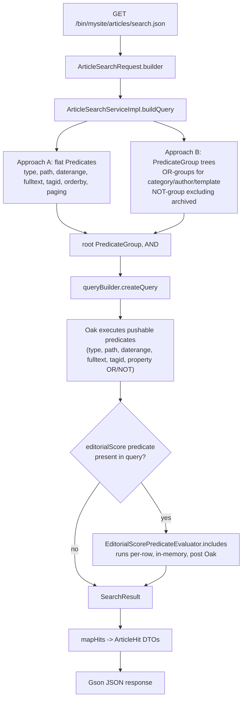

# Use Case: Article Search with Custom Predicates

## 1. Real-life scenario

A news/blog section needs search that goes beyond what QueryBuilder's
built-in predicates can express: filtering by a *computed* editorial score
derived from multiple properties, not just a single stored value. This
cluster is really two things layered together: (a) a full-featured article
search service demonstrating both QueryBuilder API styles side by side, and
(b) two custom `PredicateEvaluator`s — one that's a genuinely justified use
case, and one that deliberately demonstrates the *wrong* reason to write one.

## 2. Where it lives

| Concern | File |
|---|---|
| Search request/result DTOs | `core/.../services/search/ArticleSearchRequest.java`, `ArticleSearchResult.java` |
| Search service (interface) | `core/.../services/search/ArticleSearchService.java` |
| Search service (impl) | `core/.../services/search/ArticleSearchServiceImpl.java` |
| Justified custom predicate | `core/.../services/search/EditorialScorePredicateEvaluator.java` |
| Anti-pattern custom predicate | `core/.../services/search/FeaturedArticlePredicateEvaluator.java` |
| HTTP endpoint | `core/.../servlets/ArticleSearchServlet.java` |

## 3. Code flow, step by step

### 3a. Request → response

1. `ArticleSearchServlet.doGet()` reads query params (`category`, `author`,
   `tag`, `publishedAfter/Before`, `q`, `featured`, paging, sorting),
   builds an `ArticleSearchRequest` via its builder, and calls
   `ArticleSearchService.search()`.
2. `ArticleSearchServiceImpl.search()` adapts the resolver to a `Session`,
   builds a `PredicateGroup` via `buildQuery()`, runs it through
   `queryBuilder.createQuery(root, session).getResult()`, maps hits to
   `ArticleHit` DTOs, and wraps the result.
3. Response is serialized to JSON via Gson, same shape as the property
   search flow.

### 3b. Two ways to build the same query — both shown deliberately

`buildQuery()` is explicitly split into two labeled approaches
(the class-level comment calls this out directly):

- **Approach A — flat `Predicate`/`Map` style**: used for simple,
  single-value predicates — `type`, `path` (+ `path.exclude`), `nodename`
  glob, resource type pin, `daterange`, `fulltext`, `tagid` (repeated for
  OR), `orderby`, pagination, `p.guessTotal`. Each is a small
  self-contained `Predicate` object added directly to the root group.
- **Approach B — `PredicateGroup` Java API**: used wherever the logic needs
  a genuine AND/OR/NOT *tree*, not just a flat list — multi-value OR groups
  for categories/authors/templates (`multiValueOrGroup()`, a shared
  helper), and a NOT group excluding archived articles
  (`PredicateGroup.setNegated(true)`).

The dividing line, stated directly in the code: flat string-keyed
predicates are fine for single conditions; once you need nested OR/NOT
logic, the numbered-key string syntax (`2_group.p.or=true` etc.) gets
error-prone, and the object API is more composable and less fragile.

### 3c. When a custom `PredicateEvaluator` is justified — and when it isn't

This is the real teaching core of the cluster, and it's a **deliberate
contrast between two custom evaluators that look similar but aren't**:

**`EditorialScorePredicateEvaluator` — justified.** It filters on a score
computed by combining three separate properties (`featured` boolean,
`priority` string mapped to a weight, `viewCount` normalized/capped) with
arithmetic no built-in predicate can express. `canXpath()` returns `false`
(can't be pushed to XPath/SQL2 — it's inherently a post-filter),
`canFilter()` returns `true` so `includes()` runs per-row after Oak returns
its base result set.

**`FeaturedArticlePredicateEvaluator` — the anti-pattern, on purpose.** It
filters on a single boolean property (`jcr:content/featured`) — something
the built-in `JcrPropertyPredicateEvaluator` already does natively, and
which `ArticleSearchServiceImpl`'s own `[B-4]` comment explicitly calls out
as the *correct* way to filter a boolean flag ("A custom PredicateEvaluator
would be wrong here"). This evaluator exists specifically to show what an
*unjustified* custom evaluator looks like: it duplicates built-in behavior,
runs as an in-memory post-filter (slower — can't be pushed down to
Oak/XPath) instead of a query-plannable native predicate, and adds
maintenance surface for zero benefit.

## 4. Flow diagram

## 5. Approach comparison — the two custom evaluators

| | `EditorialScorePredicateEvaluator` | `FeaturedArticlePredicateEvaluator` |
|---|---|---|
| What it filters on | A computed score across 3 properties | A single boolean property |
| Could a built-in predicate do this? | No — no built-in predicate does cross-property arithmetic | Yes — `JcrPropertyPredicateEvaluator` already does this |
| `canXpath()` | `false` (genuinely can't be expressed as XPath/SQL2) | `false` (same, but only because it wasn't built as a native property check) |
| Performance impact | Justified cost — this logic has no cheaper equivalent | Unjustified cost — a native predicate for the same result would let Oak push the filter down and avoid loading extra candidate rows |
| Verdict | Correct use of the extension point | Anti-pattern — kept in this repo specifically as a "what not to do" reference |

**Interview framing:** the real skill being tested isn't "can you write a
`PredicateEvaluator`" — it's knowing *when not to*. A custom evaluator
always runs as an in-memory post-filter over whatever Oak's native
predicates already narrowed down; if a built-in predicate can express your
condition, using one lets Oak's query planner reason about cost and
(where applicable) use an index — a custom evaluator can't.

## 6. Gotchas / edge cases handled

- `search()` explicitly checks `session == null` after `resolver.adaptTo(Session.class)`
  and returns an empty result rather than risking a `NullPointerException`
  deeper in `queryBuilder.createQuery()`.
- `mapHits()` skips a hit if `getResource()` or its `jcr:content` child is
  `null`, and catches `RepositoryException` per-hit so one bad node doesn't
  fail the whole page.
- The date-range predicate explicitly sets `lowerOperation`/`upperOperation`
  to `>=`/`<=` — the code comments flag that QueryBuilder's default is
  strict `>` (exclusive), which is a common off-by-one mistake if left
  unset.
- The fulltext predicate is explicitly scoped with `fulltext.relPath =
  jcr:content` — the comment notes that without this, QueryBuilder scans
  all child nodes including renditions/metadata, which is expensive on
  large repos.
- `EditorialScorePredicateEvaluator.parseMinScore()` catches
  `NumberFormatException` and falls back to a documented default (50)
  rather than letting a malformed query param break the whole query.
- **Bug worth knowing about, not smoothing over**: `FeaturedArticlePredicateEvaluator`'s
  `canFilter()` javadoc comment describes the *false* case ("this predicate
  cannot be used as a JCR filter... includes() is the sole filter
  mechanism") but the method actually returns `true` — the comment doesn't
  match the code. Good habit to flag: always verify a method's real return
  value against its own doc comment, don't just trust the comment.
- **Inconsistency worth knowing about**: `ArticleSearchServlet` hardcodes
  `.rootPath("/content/mysite/en")`, while `ArticleSearchRequest`'s own
  default is `/content/sibi-aem-one/en`, and the servlet's own Javadoc
  URL example shows `/bin/mysite/articles/search.json` — this cluster
  looks like it was adapted from a generic `mysite` interview-guide
  template and the servlet's path/rootPath weren't fully renamed to match
  the rest of this project's `sibi-aem-one` naming.
- The servlet uses **fixed-path registration**
  (`sling.servlet.paths=/bin/mysite/articles/search`) rather than the
  resource-type + selector + extension binding style used by
  `PropertySearchServlet` — a legitimate alternate pattern (useful for an
  endpoint that isn't tied to any one page's resource type), but worth
  being able to explain the trade-off if asked why this one differs.

## 7. Likely interview questions this maps to

### QueryBuilder API style

1. "QueryBuilder supports building queries from a `Map<String,String>` and
   from a `PredicateGroup`/`Predicate` object tree — when would you use
   each?" — flat/simple predicates suit the map style; nested AND/OR/NOT
   logic is far less error-prone with the object API
2. "How do you express OR logic across multiple values of the same
   property using the object API?" — a `PredicateGroup` with
   `setAllRequired(false)`, one `Predicate` per value — see
   `multiValueOrGroup()`
3. "How do you express NOT logic?" — a `PredicateGroup` with
   `setNegated(true)` wrapping the predicate(s) to exclude
4. "Why does the date-range predicate explicitly set
   `lowerOperation`/`upperOperation`?" — QueryBuilder's default is strict
   `>`/`<`, not inclusive — an easy off-by-one bug if you assume otherwise

### Custom PredicateEvaluators

5. "When is it appropriate to write a custom `PredicateEvaluator`?" — only
   when the filtering logic genuinely can't be expressed by combining
   built-in predicates — e.g. arithmetic across multiple properties, as in
   `EditorialScorePredicateEvaluator`
6. "Walk me through what `canXpath()` and `canFilter()` actually control."
   — `canXpath` = can this be pushed into the XPath/SQL2 query itself (fast,
   index-eligible); `canFilter` = can `includes()` run as an in-memory
   post-filter over Oak's result rows. Most custom evaluators are
   `canXpath=false, canFilter=true`
7. "What's the performance cost of a custom `PredicateEvaluator`, and how
   do you minimize it?" — it always runs in-memory per candidate row after
   Oak's native predicates have already narrowed the set; keep your other
   (pushable) predicates as selective as possible so the custom evaluator
   only has to inspect a small candidate set
8. "This codebase has a custom evaluator for a single boolean property.
   Is that a good idea?" — good chance to walk through the anti-pattern
   explicitly: no, a native property predicate does this already and can
   be pushed down; the custom evaluator adds cost and code for zero benefit
9. "How would you register a custom `PredicateEvaluator` with QueryBuilder?"
   — `@Component(service = PredicateEvaluator.class, property =
   {"predicate.name=yourName"})`, then reference it via that name in either
   the map or object API
10. "If you found a doc comment in a codebase that didn't match what the
    code actually does, what would you do?" — a soft but real
    interview-adjacent question; good answer: trust the code over the
    comment, verify by testing/tracing, and fix or flag the stale comment
    — directly mirrors the `canFilter()` inconsistency found here

### Design / architecture

11. "Why split `ArticleSearchRequest` as an immutable builder-constructed
    DTO instead of passing individual parameters?" — ~14 optional search
    criteria; a builder avoids a telescoping method signature and keeps
    defaults centralized (e.g. `excludeArchived = true` by default)
12. "This servlet uses a fixed path registration instead of binding to a
    resource type like the property search servlet does. Why might a
    project mix both styles?" — fixed-path suits a general-purpose API
    endpoint not tied to a specific page/component; resourceType binding
    suits an endpoint that's conceptually "this component's data API"
13. "If you noticed this endpoint's default root path didn't match the
    rest of the site's content structure, what would that tell you, and
    what would you check?" — signals copy-pasted/templated code that
    wasn't fully adapted — check for the same issue in similar servlets,
    and confirm with a real request before assuming it's dead code

### Debugging scenarios

14. "A search with `editorialScore` filtering is much slower than a
    similar search without it — is that expected?" — yes, by design: it's
    a mandatory in-memory post-filter; the fix is tightening the other
    (pushable) predicates so fewer candidate rows ever reach it, not trying
    to make the evaluator itself "faster" through indexing
15. "A caller passes `featured=true` but results still include
    non-featured articles. What would you check?" — which code path
    handled it: the correct built-in property predicate path (`[B-4]` in
    `ArticleSearchServiceImpl`) vs whether `featuredArticle` custom
    predicate params were accidentally used instead and misconfigured
    (wrong `property` override, or the param not literally `"true"` since
    the check is case-insensitive string equality)
