# Use Case: Author Instance Update Automation

## 1. Real-life scenario

Many AEM projects need a recurring background task on the **author**
instance — e.g. syncing data from an external system, cleaning up stale
content, recalculating aggregates. This cluster isn't one implementation —
it's **four different ways to run recurring/triggered background work in
AEM**, side by side, so you can compare trade-offs instead of just knowing
one pattern.

## 2. Where it lives

| Approach | Files |
|---|---|
| A. Plain Sling Scheduler | `schedulers/AuthorUpdateScheduler.java`, `configs/AuthorUpdateSchedulerConfig.java` |
| B. Cluster-safe Sling Scheduler | `schedulers/AuthorUpdateClusterScheduler.java`, `configs/AuthorUpdateClusterSchedulerConfig.java` |
| C. Sling Job Queue, manually triggered | `jobs/AuthorUpdateJobProducer.java`, `jobs/AuthorUpdateJobConsumer.java` |
| D. Sling Job Queue, self-scheduled | `jobs/AuthorUpdateScheduledJobProducer.java`, `jobs/AuthorUpdateScheduledJobConsumer.java`, `configs/AuthorUpdateScheduledJobConfig.java` |

## 3. Code flow, step by step

### A. Plain Sling Scheduler (`AuthorUpdateScheduler`)

1. `@Activate` reads `AuthorUpdateSchedulerConfig` (`enabled`, `cronExpression`).
2. If enabled, builds `ScheduleOptions` from the cron expression, sets
   `canRunConcurrently(false)`, and calls `scheduler.schedule(this, options)`
   — `this` because the component itself implements `Runnable`.
3. On each cron fire, `run()` executes directly on whichever instance the
   scheduler is registered on.
4. `@Deactivate` unschedules by name.

### B. Cluster-safe Sling Scheduler (`AuthorUpdateClusterScheduler`)

1. Same activation/config pattern as A, but `run()` adds two layers of
   protection before doing any work:
   - **JVM-level lock** (`ReentrantLock.tryLock()`) — guards against the
     *same instance* re-entering if a previous run is still in progress.
   - **Repository-level lock** (JCR `LockManager.lock()` on
     `/var/sibi-aem-one/locks/author/update`) — guards against *other
     cluster nodes* running the same job at the same time, since the
     Scheduler itself runs independently on every node in a cluster.
2. `getResourceResolver()` uses a **service user** (`SUBSERVICE=scheduler`)
   rather than an admin session — the resolver is opened per-run and closed
   via try-with-resources.
3. `getClusterLock()` creates the lock node path if missing, checks
   `lockManager.isLocked()`, and takes an open-scoped, session-scoped lock
   with a 300-second timeout if free; `releaseClusterLock()` always runs in
   a `finally` block.
4. The class-level comment is explicit about scope: this pattern only helps
   when multiple AEM instances share one repository (Mongo/DocumentMK-backed
   clusters) — it's meaningless on a single TarMK instance.

### C. Sling Job Queue, manually triggered (`AuthorUpdateJobProducer` / `Consumer`)

1. `AuthorUpdateJobProducer.triggerJob(payload)` — **not wired to any cron
   or event in this codebase**; it's called on demand (e.g. from a servlet,
   listener, or another job) whenever *something happens* that should
   trigger author-side work.
2. `jobManager.addJob(topic, props)` puts a job on the queue with a
   `payloadPath` property.
3. `AuthorUpdateJobConsumer`, registered for that same topic via
   `JobConsumer.PROPERTY_TOPICS`, picks it up (Sling's job engine handles
   distribution — only one cluster node processes a given job) and returns
   `JobResult.OK`/`FAILED`.

### D. Sling Job Queue, self-scheduled (`AuthorUpdateScheduledJobProducer` / `Consumer`)

1. `@Activate`/`@Modified` call `scheduleJob()`, which first checks
   `jobManager.getScheduledJobs(topic, ...)` to avoid registering a
   duplicate schedule if one already exists.
2. Builds the recurring job via `jobManager.createJob(topic).properties(...)
   .schedule().cron(expr).add()` — this persists the schedule itself
   (`/var/eventing/scheduled-jobs`), not just an in-memory cron trigger.
3. When the cron fires, the Job Queue engine creates an actual `Job`
   (`/var/eventing/jobs`) and routes it to `AuthorUpdateScheduledJobConsumer`
   — cluster-safe *natively*, because Sling's job engine already guarantees
   a job is processed exactly once across the cluster, no manual locking
   needed.
4. `@Deactivate`/`@Modified` call `unscheduleJob()` to remove the persisted
   schedule cleanly.

## 4. Flow diagram

```mermaid
flowchart TD
    subgraph A["A. Plain Scheduler"]
        A1[cron fires] --> A2[run\ndirectly on this node] --> A3[no cluster guard]
    end

    subgraph B["B. Cluster-safe Scheduler"]
        B1[cron fires\non every node] --> B2{JVM lock free?}
        B2 -- no --> B5[skip]
        B2 -- yes --> B3{JCR cluster lock free?}
        B3 -- no --> B5
        B3 -- yes --> B4[do work] --> B6[release both locks]
    end

    subgraph C["C. Manual Job Trigger"]
        C1[some event/servlet\ncalls triggerJob] --> C2[jobManager.addJob] --> C3[Consumer.process\non one cluster node]
    end

    subgraph D["D. Self-scheduled Job"]
        D1["@Activate: check for\nexisting schedule"] --> D2[jobManager\n.createJob.schedule.cron.add]
        D2 --> D3["persisted at\n/var/eventing/scheduled-jobs"]
        D3 -->|cron fires| D4[Job Queue creates Job] --> D5[Consumer.process\non exactly one node]
    end
```

## 5. Approach comparison

| | A. Plain Scheduler | B. Cluster Scheduler | C. Manual Job | D. Scheduled Job |
|---|---|---|---|---|
| **Trigger type** | Cron | Cron | Event-driven (on demand) | Cron |
| **Cluster-safe?** | No — runs on every node | Yes, via manual JCR lock | N/A (per-trigger), but processed once via job engine | Yes, natively via job engine |
| **How safety is achieved** | Not addressed | App-level distributed lock you write and maintain | Sling job engine's built-in single-processing guarantee | Sling job engine's built-in guarantee, no manual lock code |
| **Persistence of schedule** | In-memory only (lost on restart until component reactivates) | In-memory only | N/A — no schedule, only triggered jobs | Persisted (`/var/eventing/scheduled-jobs`) — survives restarts |
| **Retry on failure** | No built-in retry | No built-in retry | Yes — `JobResult.FAILED` triggers Sling's retry | Yes — same retry mechanism |
| **Best fit** | Single-instance/dev setups, or truly node-local work (e.g. clearing a local cache) | Legacy/simple setups where you don't want the job-queue infrastructure but do need cluster safety | Work triggered by application events, not time (e.g. "sync when this content is activated") | Recurring cluster-safe work — this is the pattern most real AEMaaCS projects should default to |

**When you'd actually pick each one, in interview terms:** if asked "how do
you run a recurring job safely in a clustered AEM environment," the
textbook-correct answer is **D** — let Sling's Job Queue own both the
scheduling and the cluster-safety guarantee, rather than reinventing
distributed locking yourself (as B does). B is worth knowing *how* to build
because it shows you understand what the job engine is doing for you under
the hood, and because some older/simpler codebases still use it.

## 6. Gotchas / edge cases handled

- **B's lock node creation isn't itself safe against a race** — two nodes
  could both hit `!session.nodeExists(LOCK_PATH)` simultaneously and both
  try to create it; in practice the JCR save would conflict and one would
  fail, but this isn't explicitly handled with a retry.
- **C's producer isn't called from anywhere in this codebase** — it's a
  template for "whatever triggers this job in your real project," not a
  complete feature on its own. Worth remembering when walking through it —
  don't imply it's wired to something it isn't.
- **D checks for existing scheduled jobs before adding a new one** — avoids
  the classic OSGi re-activation bug where a component restart (e.g. config
  change) would otherwise create duplicate schedules.
- **A has no failure handling at all** — `run()` in this codebase is a stub;
  in a real implementation, an uncaught exception inside `run()` would just
  be logged by the scheduler's own error handling, not retried.

## 7. Likely interview questions this maps to

### Architecture / comparison

1. "You need a recurring job that only runs once across an AEM cluster —
   how do you do it, and why?" — Job Queue's `schedule().cron()` (approach D);
   explain *why* over rolling your own lock
2. "What's the actual difference between Sling Scheduler and Sling Job
   Queue?" — Scheduler runs on every node independently and has no built-in
   distribution/retry; Job Queue is designed for distributed, exactly-once
   (per job) processing with retry
3. "Why would you ever use the Scheduler at all if the Job Queue is
   'better'?" — for genuinely node-local work with no cross-instance
   concern (e.g. clearing an in-memory cache on that specific node), the
   Job Queue's cluster coordination is pure overhead
4. "Walk me through what happens if two cluster nodes' schedulers both fire
   at the same second in approach B." — both hit `tryLock()` locally (fine,
   different JVMs), both try `getClusterLock()`; one wins the JCR lock,
   the other sees `isLocked()==true` and skips

### Sling Job Queue internals

5. "How does Sling guarantee a job runs on only one cluster node?" — the job
   engine coordinates job claiming across the topology via the shared
   repository; you don't need to reason about it manually the way you do
   with the raw Scheduler
6. "What does `JobResult.FAILED` actually do?" — triggers Sling's automatic
   retry (up to a configurable retry count) rather than silently dropping
   the job
7. "Where is a scheduled job's schedule actually persisted, and why does
   that matter?" — `/var/eventing/scheduled-jobs`; it means the schedule
   survives an instance restart, unlike the plain Scheduler's in-memory
   registration which needs the component to reactivate to re-register
8. "Your `scheduleJob()` checks for existing scheduled jobs before adding
   one — why is that check necessary?" — prevents duplicate schedules on
   OSGi component re-activation (e.g. a config change triggering `@Modified`)

### JCR locking

9. "Explain how the JCR lock in `AuthorUpdateClusterScheduler` actually
   works." — session-scoped lock via `LockManager.lock()` on a dedicated
   lock node, checked with `isLocked()` before acquiring, released in
   `finally`
10. "What's the risk with a fixed lock timeout like 300 seconds?" — if the
    protected work runs longer, the lock silently expires and another node
    could start a concurrent run — worth being able to say how you'd guard
    against that (e.g. periodic lock refresh, or a hard timeout on the work
    itself)
11. "Why does this use a service user resolver instead of an admin
    session?" — least-privilege principle; a scheduled background task
    shouldn't run with full admin rights just to acquire a lock and do its
    work

### Debugging scenarios

12. "A cluster-safe scheduled job seems to sometimes run twice on the same
    schedule. What would you check?" — lock timeout too short relative to
    job duration, or the lock node path itself failing to be created
    consistently across nodes
13. "A job you scheduled via the Job Queue isn't surviving an AEM restart —
    why might that be, and how does that compare to the Scheduler
    approach?" — check it's actually the persisted `schedule()` API and not
    a component simply re-registering on activate; contrast with approach
    A/B where losing the in-memory registration on restart is expected
    until the component reactivates
14. "Your job consumer keeps failing and retrying forever — what would you
    look at?" — whether the failure is transient (should retry) vs
    permanent (should return `JobResult.CANCEL` instead of `FAILED` to stop
    retries) — a distinction this codebase's consumers don't currently make
