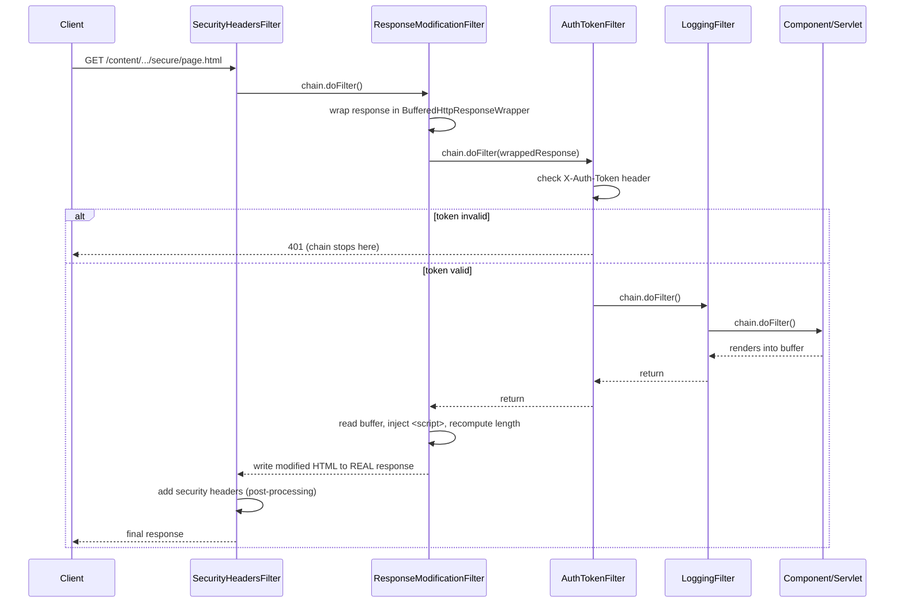

# Use Case: Request/Response Filter Pipeline

## 1. Real-life scenario

Almost every real AEM project needs cross-cutting request/response concerns
handled outside individual servlets/components: blocking unauthenticated
requests to a secure section, adding security headers to every page,
logging traffic, injecting a tracking script into rendered HTML, and
catching uncaught errors gracefully. This cluster is a set of Sling
`Filter`s, each demonstrating one of those concerns — plus two different
ways of *registering* a filter with Sling (legacy property-based vs the
newer `@SlingServletFilter` annotation).

## 2. Where it lives

| Concern | File |
|---|---|
| Auth gate on a secure path | `filters/AuthTokenFilter.java` |
| Security response headers | `filters/SecurityHeadersFilter.java` |
| Catch uncaught errors | `filters/GlobalErrorFilter.java` |
| Request logging (legacy registration style) | `filters/LoggingFilter.java` |
| Request/response logging (modern registration style) | `filters/ModernLoggingFilter.java` |
| Rewriting rendered HTML | `filters/ResponseModificationFilter.java` + `filters/BufferedHttpResponseWrapper.java` |

## 3. Code flow, step by step

### 3a. How a Sling filter gets registered at all

Every filter here is an OSGi `Filter` service, but there are **two
registration styles** in this codebase:

- **Legacy (`LoggingFilter`)** — a raw `@Component` with a manually-set
  property `EngineConstants.SLING_FILTER_SCOPE + "=" + FILTER_SCOPE_REQUEST`,
  plus separate `@ServiceRanking`/`@ServiceDescription`/`@ServiceVendor`
  property-type annotations. This is how you'd write a filter before Sling
  added the annotation shortcut.
- **Modern (`AuthTokenFilter`, `SecurityHeadersFilter`, `GlobalErrorFilter`,
  `ModernLoggingFilter`, `ResponseModificationFilter`)** — the
  `@SlingServletFilter` annotation, which lets you declare `scope`,
  `pattern`, `resourceTypes`, `selectors`, `extensions`, and `methods`
  directly, generating the equivalent OSGi properties for you.

Both styles produce the same underlying OSGi service properties — the
newer one is just far less boilerplate and lets you restrict a filter to a
resource type/selector/extension combination without hand-rolling that
matching logic inside `doFilter()` yourself.

### 3b. Request chain, in actual invocation order

For a `REQUEST`-scoped filter chain, **higher `service.ranking` runs
first**. Given this codebase's rankings (default is `0` when unset):

| Filter | `service.ranking` | Pattern scope |
|---|---|---|
| `SecurityHeadersFilter` | 0 (default) | `/content/.*` |
| `ResponseModificationFilter` | 0 (default) | `/content/sibi-aem-one/.*`, `.html` only |
| `AuthTokenFilter` | -200 | `/content/sibi-aem-one/secure/.*` |
| `LoggingFilter` | -700 | `/content/.*` (all paths, legacy style) |
| `ModernLoggingFilter` | -800 | `/content/sibi-aem-one/.*`, selectors `print`/`mobile` only |

So for a request to e.g. `/content/sibi-aem-one/secure/page.html`:

1. `SecurityHeadersFilter` and `ResponseModificationFilter` wrap the chain
   first (both rank 0 — tie broken by service ID)
2. `AuthTokenFilter` runs next and can **short-circuit the whole chain** —
   if the token is missing/invalid it calls `sendError()` and returns
   *without* calling `chain.doFilter()`, so nothing downstream (including
   the actual component render) ever executes
3. `LoggingFilter` runs after that
4. `ModernLoggingFilter` runs last of the REQUEST-scoped filters shown here
   — but only if the request also matches its selector restriction
   (`print`/`mobile`), which most requests won't

`GlobalErrorFilter` is on a **separate chain entirely** — `scope = ERROR`
— which Sling only invokes when request processing produces an
unhandled error and gets internally re-dispatched to error handling. It
does not run on the happy path at all.

### 3c. Pre- vs post-processing pattern

Several filters demonstrate the two shapes a filter's logic can take
around `chain.doFilter()`:

- **Pre-processing only, can block**: `AuthTokenFilter` — checks the
  token *before* calling `chain.doFilter()`, and skips calling it entirely
  on failure.
- **Post-processing only**: `SecurityHeadersFilter` — calls
  `chain.doFilter()` first, *then* adds headers to the now-generated
  response.
- **Both pre and post**: `ModernLoggingFilter` — logs before
  `chain.doFilter()` (incoming request) and after it (response status).
- **Post-processing that needs to see/alter the body**:
  `ResponseModificationFilter` — this is the interesting one, covered next.

### 3d. Buffering and rewriting the response body

`ResponseModificationFilter` needs to inject a `<script>` tag before
`</body>` — but by the time `chain.doFilter()` returns, the real response
has typically already started streaming to the client, so you can't just
read-then-rewrite it directly. The fix is `BufferedHttpResponseWrapper`:

1. `ResponseModificationFilter` wraps the real `HttpServletResponse` in a
   `BufferedHttpResponseWrapper` and passes the **wrapper** down the chain.
2. Every downstream write — whether the component uses `getWriter()`
   (text) or `getOutputStream()` (binary) — the wrapper intercepts both
   and buffers everything into an in-memory `ByteArrayOutputStream`,
   nothing reaches the real client yet.
3. After `chain.doFilter()` returns, the filter calls
   `wrappedResponse.getBufferedContent()` to get the full rendered HTML as
   a string, does a plain `String.replace("</body>", ...)`, recalculates
   `Content-Length` for the modified byte count, and only *then* writes to
   the **real** response.

## 4. Flow diagram

## 5. Approach comparison — legacy vs modern filter registration

| | `LoggingFilter` (legacy) | `ModernLoggingFilter` (`@SlingServletFilter`) |
|---|---|---|
| Registration | Manual `EngineConstants.SLING_FILTER_SCOPE` property string + separate property-type annotations | Single declarative annotation |
| Path/resourceType/selector/extension restriction | Would have to be checked manually inside `doFilter()` | Declared directly in the annotation — Sling handles the match before your filter code even runs |
| Readability | More boilerplate, easy to typo a property string | Self-documenting |
| When you'd still see the legacy style | Older codebases, or projects that haven't upgraded `org.apache.sling.servlets.annotations` | New code has little reason to use it |

**Interview framing:** knowing *both* matters less than being able to
explain *why* the annotation-based approach is strictly better for new
code — it moves matching logic (selectors, extensions, resource types) out
of your `doFilter()` body and into declarative metadata Sling enforces for
you, which is both less error-prone and easier for another engineer to
understand at a glance.

## 6. Gotchas / edge cases handled

- `AuthTokenFilter` explicitly comments that failing to call
  `chain.doFilter()` is what blocks the request — a common bug is
  forgetting this and letting the request fall through anyway.
- `ResponseModificationFilter` recalculates `Content-Length` after
  modifying the HTML — a very common real bug in response-rewriting
  filters is leaving the original (now-wrong) content length, which
  truncates or corrupts the response in some clients/proxies.
- `BufferedHttpResponseWrapper` overrides **both** `getWriter()` and
  `getOutputStream()` — components may use either depending on whether
  they're writing text or binary; only intercepting one would silently
  break the other type of component.
- `ResponseModificationFilter` checks for an empty buffered response and
  bails out (writes nothing / logs a warning) rather than blindly
  string-replacing on empty content.
- `GlobalErrorFilter` catches the exception, logs it with the resource
  path, but the comment notes it should forward to a custom error page —
  as written it swallows the exception without producing any response
  body, which in a real project would need finishing.
- `AuthTokenFilter`'s `isValid()` is a stub returning `true` always, with
  a commented-out `@Reference TokenValidationService` — clearly marked as
  a placeholder for real token validation logic, not a working auth check.

## 7. Likely interview questions this maps to

### Filter chain ordering

1. "How does Sling decide the order filters run in?" — `service.ranking`;
   higher value runs earlier in the REQUEST chain
2. "If two filters have the same ranking, what decides order?" — service ID
   (registration order) as the tiebreaker
3. "In this codebase, which filter runs first on a request to
   `/content/sibi-aem-one/secure/page.html`, and why?" — walk through the
   ranking table in section 3b
4. "Why is `GlobalErrorFilter` on its own chain instead of REQUEST scope?" —
   `ERROR` scope is a distinct filter chain Sling invokes only during error
   dispatch, not on the normal request path

### Response modification / buffering

5. "How would you inject something into every rendered page's HTML, like a
   tracking script?" — wrap the response, buffer downstream output, modify,
   recompute `Content-Length`, write to the real response
6. "Why can't you just modify the response after `chain.doFilter()`
   without wrapping it first?" — by then the component may have already
   written directly to the real output stream/writer; you have nothing to
   intercept unless you substitute your own wrapper *before* calling
   `chain.doFilter()`
7. "What's the risk of buffering the entire response body in memory like
   this?" — memory pressure on very large responses; this pattern is fine
   for typical HTML pages but wouldn't scale to large file downloads,
   which is part of why `ResponseModificationFilter` restricts itself to
   `extensions = "html"`
8. "Why override both `getWriter()` and `getOutputStream()` in the
   wrapper?" — different components use different response APIs depending
   on whether they write text or binary; missing either would silently
   break some components

### Auth / security filters

9. "Where would you actually put token validation logic, and why isn't it
   in the filter itself here?" — the commented-out
   `@Reference TokenValidationService` shows the intended real design:
   filters should stay thin and delegate to a service, both for testability
   and to avoid duplicating validation logic if it's needed elsewhere
10. "Why add security headers as post-processing instead of
    pre-processing?" — headers like `X-Frame-Options` apply to the
    *response*; there's nothing to set until a response exists, so it
    makes sense after `chain.doFilter()` returns
11. "What would happen to `AuthTokenFilter` if it forgot to `return` after
    calling `sendError()`?" — execution would fall through to
    `chain.doFilter()` anyway, meaning the "blocked" request actually
    proceeds — a subtle but serious bug class in filter code generally

### Legacy vs modern registration

12. "What's the difference between the old-style filter registration and
    `@SlingServletFilter`?" — see section 5's comparison table
13. "If you inherited a project using the legacy style, would you migrate
    it?" — good discussion question: functionally equivalent, so it's a
    readability/maintainability call, not a correctness one — a
    reasonable answer is "not urgently, but new filters should use the
    modern annotation"

### Debugging scenarios

14. "A filter that's supposed to add a header to every page isn't showing
    up in the response. What would you check first?" — pattern regex
    actually matching the request/resource path, `service.ranking`
    causing a different filter to short-circuit the chain earlier (like
    `AuthTokenFilter` does), and whether the filter is even active in
    `/system/console/requests`' filter trace
15. "A response-rewriting filter is producing a broken/truncated page in
    some browsers but not others. What's a likely cause?" — stale
    `Content-Length` header not recalculated after modifying the buffered
    content
16. "Your error filter isn't catching an exception you'd expect it to.
    Why might that be?" — scope mismatch (it's registered for `ERROR`
    scope, which only fires on internal error dispatch, not on every
    exception path — some exceptions may be handled/swallowed earlier in
    the chain before ever reaching error dispatch)
