# Use Case: Granite UI Select Dropdowns via Custom Servlet Datasources

## 1. Real-life scenario

Touch UI `select` fields often need their options populated dynamically —
from a PIM system, a taxonomy tree, a campaign list — rather than a static
hardcoded list in the dialog XML. This cluster shows the standard AEM
pattern for that: a servlet registered against a *virtual* resource type
that a dialog's `<datasource>` node points to, returning a `DataSource` of
option rows. Two servlets demonstrate two different ways to build the
`Resource` objects that back each dropdown option.

## 2. Where it lives

| Concern | File |
|---|---|
| Property Type dropdown datasource | `core/.../datasources/PropertyTypeDataSourceServlet.java` |
| Campaign dropdown datasource | `core/.../servlets/CampaignDataSourceServlet.java` |
| Dialog wiring it into (correct) | `ui.apps/.../propertylisting/_cq_dialog/.content.xml` |
| Dialog wiring it into (broken) | `ui.apps/.../advanced-teaser/_cq_dialog.xml` |

## 3. Code flow, step by step

### 3a. The datasource contract

1. A Touch UI `select` field's dialog XML has a `<datasource>` child node
   with a `sling:resourceType` pointing at a **virtual** resource path —
   there's no actual JCR content at that path, it's purely a Sling servlet
   registration target.
2. AEM's dialog-rendering pipeline resolves that resource type to whichever
   servlet is registered against it (`@SlingServletResourceTypes` /
   `sling.servlet.resourceTypes` property) and calls its `doGet()`.
3. The servlet builds a list of `Resource` objects (each one an "option
   row" with `text`/`value` properties), wraps them in a
   `SimpleDataSource`, and sets it as a request attribute under
   `DataSource.class.getName()` — Granite's rendering code reads that
   attribute back to actually draw the `<option>` elements.

### 3b. Two ways to build the option `Resource`s

**`PropertyTypeDataSourceServlet`** hand-rolls a minimal `Resource`
implementation, `SimpleOptionResource extends AbstractResource`, overriding
just `getPath()`, `getResourceType()`, `getResourceSuperType()`,
`getResourceMetadata()`, `getResourceResolver()`, and `getValueMap()`
(the last one is what actually carries the `text`/`value` data — the
comment notes `AbstractResource` auto-delegates `adaptTo(ValueMap.class)`
to it).

**`CampaignDataSourceServlet`** instead uses Granite's own
`com.adobe.granite.ui.components.ds.ValueMapResource` — a ready-made
`Resource` implementation built exactly for this scenario, constructed
directly from a `ResourceResolver`, `ResourceMetadata`, a resource type
string, and a `ValueMap` — no custom class needed at all.

### 3c. Building and returning the DataSource

Both servlets follow the identical last step regardless of which `Resource`
approach they used:

```java
DataSource dataSource = new SimpleDataSource(options.iterator());
request.setAttribute(DataSource.class.getName(), dataSource);
```

`SimpleDataSource` just wraps an `Iterator<Resource>` — it doesn't care how
each `Resource` was constructed, which is exactly why both approaches are
interchangeable from Granite's perspective.

## 4. Flow diagram

```mermaid
sequenceDiagram
    participant Author as Author opens dialog
    participant Granite as Granite UI select field
    participant Servlet as *DataSourceServlet
    participant Resource as Resource rows

    Author->>Granite: renders <select> with <datasource> child
    Granite->>Servlet: resolves sling:resourceType -> doGet()
    Servlet->>Resource: build option rows (custom Resource OR ValueMapResource)
    Servlet->>Servlet: wrap in SimpleDataSource(iterator)
    Servlet->>Granite: request.setAttribute(DataSource.class.getName(), ds)
    Granite->>Author: renders <option> per row (text/value)
```



## 5. Approach comparison

| | `PropertyTypeDataSourceServlet` (custom `Resource`) | `CampaignDataSourceServlet` (`ValueMapResource`) |
|---|---|---|
| Resource implementation | Hand-written `SimpleOptionResource extends AbstractResource` (~15 lines) | Granite's built-in `ValueMapResource` — zero extra code |
| Why write your own at all | The code comment gives the real reason: `AbstractResource` has existed since Sling's earliest API versions, while `ValueMapResource` (Granite's helper, and the similarly-named `org.apache.sling.api.wrappers.ValueMapResource` added ~2.16/2.17) carries a *dependency-version risk* on older AEM/Sling versions | Assumes a baseline where Granite's `ValueMapResource` is available (true for any reasonably current AEM version) |
| Amount of code | More boilerplate, full control over every `Resource` method | Minimal — just build a `ValueMap` and hand it to the constructor |
| When you'd pick each | Maintaining compatibility with an older AEM version, or needing custom `Resource` behavior beyond what `ValueMapResource` offers | The default choice for any current AEM project — no reason to hand-roll this |

**Interview framing:** the "right" answer for new code on a current AEM
version is `ValueMapResource` — less code, framework-maintained,
purpose-built for exactly this. Knowing how to write `SimpleOptionResource`
by hand is what you'd need only if you were supporting an older AEM
version or needed a `Resource` with behavior `ValueMapResource` doesn't
cover — a good example of "know the shortcut, but also know what it's
short-cutting."

## 6. Gotchas / edge cases handled — and one that's actually broken

- `PropertyTypeDataSourceServlet`'s options are a static hardcoded list —
  the class Javadoc explicitly says this is a placeholder: "In production,
  replace the static list with a call to a PIM/CMS API or a JCR query
  against a taxonomy tree." Don't mistake this for the finished design —
  it's a template to build on.
- Both servlets extend `SlingSafeMethodsServlet` and only implement
  `doGet()` — appropriate since populating dropdown options is a read-only
  operation, same reasoning as `PropertySearchServlet` in the search
  cluster.
- The `advanced-teaser` dialog's second campaign-related field
  (`secondaryCampaign`) instead points at the **ACS Commons generic list**
  datasource (`acs-commons/.../genericlist/datasource`) — the same pattern
  already documented for the `currency` field in the Property Listing
  cluster: delegate to ACS Commons rather than writing a servlet at all,
  when the option list is just author-managed static content rather than
  something computed or pulled from an external system.

## 7. Likely interview questions this maps to

### Datasource mechanics

1. "How does a Touch UI select field get its options from a servlet
   instead of a static list?" — a `<datasource>` child node with a
   `sling:resourceType` pointing at a virtual resource type a servlet is
   registered against; the servlet builds a `DataSource` and sets it as a
   request attribute
2. "What has to be true about the resource type string for this to
   actually work?" — it must exactly match what the servlet registers
   against (`sling.servlet.resourceTypes` / `@SlingServletResourceTypes`)
   — a mismatch (as seen in this codebase's campaign dropdown) silently
   fails with no options rendered
3. "What's the minimum a `Resource` implementation needs to back one
   dropdown option?" — a path, resource type, and a `ValueMap` with
   `text`/`value` — everything else can return sensible defaults/nulls

### Built-in vs custom implementation

4. "Why would you write your own `Resource` implementation instead of
   using `ValueMapResource`?" — dependency-version risk on older AEM/Sling
   versions where `ValueMapResource` may not be available yet, or a need
   for custom `Resource` behavior it doesn't provide
5. "If you're on a current AEM version, is there any reason not to use
   `ValueMapResource`?" — generally no; it's the framework-maintained,
   purpose-built option for exactly this case

### Alternatives worth knowing

6. "When would you use ACS Commons' generic list datasource instead of
   writing a custom servlet?" — when the option list is simple,
   author-managed, static content (like a list of currency codes) rather
   than something that needs to be computed, filtered, or pulled from an
   external system at request time
7. "What's the trade-off of the ACS Commons approach?" — no code to write
   or deploy, but content authors must maintain the list under
   `/etc/acs-commons/lists/...` (or `/conf/...` on newer ACS Commons
   versions) separately, and it can't express dynamic logic

### Debugging scenarios

8. "A dropdown is showing no options at all, and there's no error in the
   logs. What would you check first?" — exact-match the dialog's
   `<datasource>` `sling:resourceType` string against what the servlet is
   actually registered for; a typo or leftover template placeholder (as
   in this codebase's `myproject` vs `sibi-aem-one` mismatch) fails
   silently rather than throwing
9. "How would you confirm which servlet resolves for a given resource
   type, without reading all the source code?" — Sling's resource
   type/servlet resolution can be inspected via
   `/system/console/servletresolver` in the OSGi console, which lets you
   simulate a request and see exactly which servlet would handle it
10. "Why does neither servlet override `doPost()`?" — populating dropdown
    options is inherently a read operation triggered by the dialog
    rendering; there's no reason for it to accept writes, and
    `SlingSafeMethodsServlet` communicates that constraint at the type level
