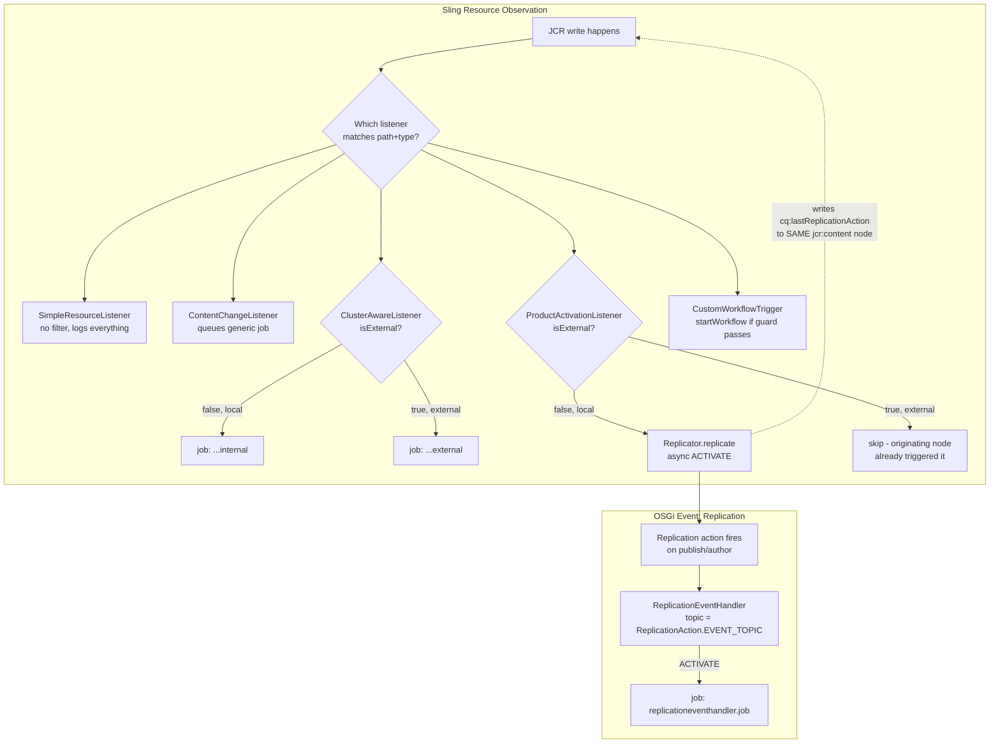

# Use Case: JCR/Resource Change Observation & Event Handling

## 1. Real-life scenario

Real AEM projects constantly need to react to content changes without a
human clicking a button: auto-republish a product page when its price
changes, kick off a custom workflow when a DAM asset lands in a folder,
fan out replication events to other systems, or simply audit what's
changing where. This cluster covers the two parallel observation
mechanisms AEM offers — Sling's `ResourceChangeListener` (the modern JCR
observation API) and OSGi's generic `EventHandler` (used here for
replication-specific events) — across five listeners of increasing
sophistication.

## 2. Where it lives

| Concern | File |
|---|---|
| Bare-minimum observation demo | `core/.../listeners/SimpleResourceListener.java` |
| Scoped observation → job handoff | `core/.../listeners/ContentChangeListener.java` |
| Cluster-aware (local vs external) observation | `core/.../listeners/ClusterAwareListener.java` |
| Observation-triggered auto-replication | `core/.../listeners/ProductActivationListener.java` |
| Observation-triggered workflow launch | `core/.../listeners/CustomWorkflowTrigger.java` |
| OSGi `EventHandler` for replication events | `core/.../handlers/ReplicationEventHandler.java` |

## 3. Code flow, step by step

### 3a. `SimpleResourceListener` — the baseline

Registers for `ResourceChangeListener` with **no path/change-type
filtering at all** — it receives every resource change across the entire
repository and just logs it at `debug`. This is explicitly an
Adobe-sample-derived "hello world" of the observation API (the file even
retains the original Apache 2.0 license header from Adobe's sample repo),
not something you'd run unscoped in production — every other listener in
this cluster narrows scope via `ResourceChangeListener.PATHS`.

### 3b. `ContentChangeListener` — scoped observation + job handoff

1. Registers with **four separate `PATHS` globs** simultaneously (exact
   path, `*.html` glob, `products/**` glob, `jcr:content` glob) and three
   `CHANGES` types (`ADDED`/`CHANGED`/`REMOVED`).
2. `onChange()` filters out `jcr:content` sub-paths (so it reacts once per
   page-level change, not once per property), then hands each change off
   to a **Sling Job** via `jobManager.addJob()` rather than doing any real
   work inline.
3. This handoff pattern is the important part: `onChange()` runs on
   Sling's shared observation-event thread — any listener that blocks or
   does expensive work there risks backing up the entire event queue for
   the instance. Queuing a job instead returns from `onChange()` almost
   immediately and lets the job-processing infrastructure (with its own
   retry/threading) do the real work.

### 3c. `ClusterAwareListener` — distinguishing local vs. external changes

1. Filters more precisely with a `Stream` pipeline: skip `jcr:content/`
   property-level noise, keep only page-level (`jcr:content` or non-`jcr:`)
   nodes, skip `REMOVED` changes entirely.
2. The key feature: `change.isExternal()` — in a clustered/DocumentMK-backed
   repository, an observation event fires on **every** cluster node, but
   `isExternal()` tells you whether the change originated on *this* node
   (`false`) or was replicated in from another node (`true`).
3. Routes to two different job topics (`...job.internal` vs
   `...job.external`) depending on that flag — a common real pattern:
   only the node where a change actually originated should perform certain
   side effects (e.g. sending a notification), while other cluster nodes
   seeing the same change externally should skip that side effect to avoid
   duplicating it once per cluster node.

### 3d. `ProductActivationListener` — auto-publish on price change

1. Scoped to `glob:/content/sibi-aem-one/**/products/**/jcr:content`,
   `CHANGES=CHANGED` only.
2. Skips `change.isExternal()` changes (the node where the edit actually
   happened is responsible for triggering replication; other cluster nodes
   seeing the same change externally shouldn't re-trigger it).
3. For a local change, calls `triggerReplication(pagePath)`: obtains a
   **service-user** `ResourceResolver` (subservice `product-replication-service`,
   which must be mapped in a `ServiceUserMapperImpl.amended` config —
   not shown in this cluster but referenced by name), adapts it to a JCR
   `Session`, and calls `Replicator.replicate(session, ACTIVATE, pagePath,
   options)` with `setSynchronous(false)` so the call queues the
   replication action and returns immediately rather than blocking the
   observation thread on a network call to the publish tier.
4. The resolver is closed in a `finally` block regardless of outcome.

### 3e. `CustomWorkflowTrigger` — observation-triggered workflow launch

1. Scoped to DAM asset changes under `/content/dam/sibi-aem-one`,
   `ADDED`/`CHANGED`.
2. For each change, opens a service-user resolver (subservice
   `workflow-service`), calls a `shouldTriggerWorkflow()` guard (a stub —
   `return true;`, explicitly marked as "your complex Java logic goes
   here"), and if true, adapts the resolver to `WorkflowSession`, loads a
   named workflow model, and calls `startWorkflow()`.
3. This is the pattern for "asset lands in DAM → kick off a review/
   processing workflow automatically" without any manual step.

### 3f. `ReplicationEventHandler` — the other observation mechanism

1. This one is **not** a `ResourceChangeListener` at all — it's a plain
   OSGi `EventHandler` registered against the specific topic
   `ReplicationAction.EVENT_TOPIC`, which AEM's replication subsystem
   publishes to whenever a replication action occurs (activate,
   deactivate, etc.) — a mechanism that predates and is independent of
   Sling's resource observation API.
2. Reads `PN_ACTION_TYPE` and the path off the `Event`, and for `ACTIVATE`
   actions specifically, queues a job — same "keep the handler thin, hand
   off real work to a job" discipline as the resource listeners.
3. Worth knowing this is a genuinely different API from
   `ResourceChangeListener`: it reacts to *replication actions themselves*
   (a page being published/unpublished), not to *content changes* — you'd
   use this to react to "this page just went live," which
   `ResourceChangeListener` alone can't tell you directly (it would only
   tell you the underlying JCR write happened, without replication
   semantics).

## 4. Flow diagram

## 5. Approach comparison — the two observation mechanisms, and increasing listener sophistication

| | `ResourceChangeListener` (Sling) | `EventHandler` (OSGi, replication topic) |
|---|---|---|
| What it reacts to | Any JCR/resource tree write, scoped by path glob + change type | Specific application-level events published to a named topic — here, replication actions |
| Cluster semantics | `ExternalResourceChangeListener` marker / `isExternal()` tells you local vs. replicated-in | No built-in local/external distinction shown here |
| Granularity | Very fine — property-level if you don't filter it out | Coarse — one event per replication action |
| Use it for | "Something in the content tree changed" | "A specific AEM subsystem event occurred" (replication, workflow, etc. each have their own topics) |

| Listener | What it adds over the previous one |
|---|---|
| `SimpleResourceListener` | Baseline — no filtering, logs only |
| `ContentChangeListener` | Path/type filtering + job handoff (don't block the observation thread) |
| `ClusterAwareListener` | + local vs. external distinction, routes differently per case |
| `ProductActivationListener` | + a real side effect (auto-publish) gated correctly on `isExternal()` |
| `CustomWorkflowTrigger` | + triggering a completely different subsystem (workflow) from observation |

## 6. Gotchas / edge cases handled — and several real issues worth catching

- **Likely real infinite-loop risk in `ProductActivationListener`**: the
  class's own Javadoc explicitly claims *"Self-trigger-loop avoidance —
  replication itself causes a JCR write under
  jcr:content/cq:lastReplicat* ... We exclude replication-status
  properties from re-triggering."* But the actual `onChange()` code
  **only checks `change.isExternal()`** — there is no property-name
  filtering anywhere in the class. When `replicate()` runs, it writes
  `cq:lastReplicationAction`/`cq:lastReplicated` etc. back onto the
  *same* `jcr:content` node this listener is scoped to
  (`glob:.../products/**/jcr:content`), as a **local** (non-external)
  `CHANGED` event — which does **not** get filtered out, so
  `triggerReplication()` would fire again, write the status properties
  again, and potentially repeat. This is a real, checkable discrepancy
  between documented design intent and actual implementation — the kind
  of thing you'd want to verify with a live test (watch the logs after
  one price edit) rather than trust the comment.
- **`CustomWorkflowTrigger` omits `immediate = true`**, unlike every other
  listener in this cluster. Worth knowing what that actually changes: a
  non-immediate (delayed) DS component only instantiates on first
  service lookup rather than at bundle start — in practice, Sling's
  observation dispatch mechanism enumerates and looks up all registered
  `ResourceChangeListener` services regardless, which typically triggers
  activation anyway; the practical difference is mostly *when* it
  activates (bundle startup vs. first lookup), not *whether* it ever
  does — good to be able to reason through rather than just flag as
  "broken."
- **Contradiction worth noticing**: `SimpleResourceListener`'s own
  retained comment states *"apart from EventHandler services, the
  immediate flag should not be set on a service"* — yet its own
  `@Component` annotation sets `immediate = true` right above that
  comment, and three of the other four listeners do too. This is an
  inherited inconsistency from the original Adobe sample this file is
  based on, not something introduced in this project — worth being able
  to explain both sides (why the guidance exists, and why setting it
  anyway is often harmless/intentional for listener-style services) if
  asked.
- `ProductActivationListener` and `CustomWorkflowTrigger` both correctly
  close their service-user resolvers in `finally`, avoiding a session
  leak — contrast this with the observation cluster's discipline overall:
  every listener that opens a resolver here does clean up after itself.

## 7. Likely interview questions this maps to

### Observation API fundamentals

1. "How do you react to content changes in AEM without polling?" —
   `ResourceChangeListener` scoped by `PATHS`/`CHANGES` properties, or an
   OSGi `EventHandler` for subsystem-specific topics like replication
2. "Why should `onChange()` never do heavy work directly?" — it runs on a
   shared observation event thread; blocking it backs up the whole
   instance's event processing. Hand off to a Sling Job instead.
3. "What does `isExternal()` actually tell you, and when does it matter?"
   — whether a change originated on this cluster node or was replicated
   in from another node in a shared-repository (Mongo/DocumentMK) cluster;
   matters whenever a side effect (like triggering replication or sending
   a notification) should only happen once per logical change, not once
   per cluster node observing it

### Real-world patterns

4. "How would you auto-publish a page when a specific field changes?" —
   walk through `ProductActivationListener`: scope to the right path/change
   type, guard on `isExternal()`, use a service-user session, call
   `Replicator.replicate()` asynchronously
5. "Why does the replication call use `setSynchronous(false)`?" — never
   block the observation event thread on a network call to the publish
   instance
6. "How would you kick off a workflow automatically when an asset is
   uploaded?" — walk through `CustomWorkflowTrigger`: scope to the DAM
   path, evaluate a guard condition, use `WorkflowSession.startWorkflow()`
   with a service-user resolver
7. "What's the difference between reacting to replication via
   `ResourceChangeListener` vs. an `EventHandler` on the replication
   topic?" — resource observation tells you a JCR write happened;
   the replication event topic tells you a replication *action* occurred
   with its own semantics (action type, agent, etc.) — use the one that
   actually matches what you need to know

### Bug-spotting / code review

8. "This listener's Javadoc says it avoids a self-triggering loop, but
   when you read the code, does it actually?" — walk through the
   discrepancy in `ProductActivationListener` directly: only
   `isExternal()` is checked, no property-level filtering exists despite
   the comment claiming there is
9. "How would you actually verify whether that loop happens, rather than
   just reading the code?" — good one to have a real answer for: watch
   the logs after a single local edit, or write an integration test that
   counts `Replicator.replicate()` invocations for one price change
10. "How would you fix the self-trigger-loop risk if it's real?" — several
    valid answers: check whether the specific changed property is a
    replication-status property and skip those, debounce/deduplicate
    rapid successive triggers for the same path, or compare
    `cq:lastReplicationAction` timestamp against the page's own
    last-modified to detect "this change was caused by our own replicate() call"
11. "Spot the logging bug in this listener." — mismatched `{}`
    placeholder count vs. argument count in `SimpleResourceListener`
12. "What's the practical difference between a delayed and an immediate
    DS component, and does it matter here?" — reasoning through the
    `CustomWorkflowTrigger` immediate-flag omission from section 6

### Debugging scenarios

13. "A product page keeps re-publishing itself every few seconds with no
    one touching it. What would you check first?" — exactly the scenario
    the loop risk in `ProductActivationListener` would produce; check
    whether replication's own status-property write is being picked back
    up by the same listener
14. "A cluster-aware listener seems to only fire on one node instead of
    reacting appropriately across the cluster. What would you check?" —
    confirm the listener is actually deployed/active on all nodes, and
    that the local vs. external routing logic isn't accidentally
    suppressing the case you expected to see
