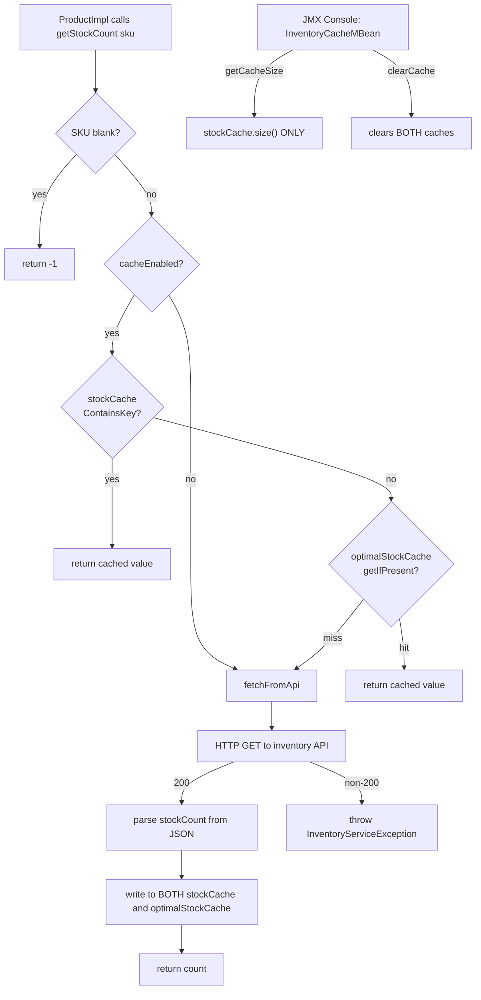

# Use Case: JMX-Monitored External API Cache (Inventory Stock Lookup)

## 1. Real-life scenario

A commerce/product page needs live stock counts from an external inventory
microservice on every render — calling that API synchronously on every
request would be far too slow and fragile. This cluster shows the standard
pattern: an OSGi service that calls an external API, caches results
in-memory, and exposes cache management (size, manual flush) to
operations via a **JMX MBean** so an admin can inspect/clear the cache
without a redeploy.

## 2. Where it lives

| Concern | File |
|---|---|
| Service contract | `core/.../services/InventoryService.java` |
| JMX MBean contract | `core/.../mbeans/InventoryCacheMBean.java` |
| Implementation (both interfaces) | `core/.../services/impl/InventoryServiceImpl.java` |

## 3. Code flow, step by step

### 3a. One component, two interfaces

`InventoryServiceImpl` implements **both** `InventoryService` (the
business contract — `getStockCount(sku)`) and `InventoryCacheMBean` (the
ops-facing contract — `getCacheSize()`, `clearCache()`), and is registered
for both: `@Component(service = {InventoryService.class,
InventoryCacheMBean.class}, ...)`. The `jmx.objectname` OSGi property on
the component is what actually exposes it as a JMX MBean, visible in a
JMX console (e.g. JConsole, or AEM's own JMX support) under
`com.sibi.aem.one:type=CacheManagement,name=Inventory Stock Cache`.

### 3b. Lifecycle — HTTP client and cache setup/teardown

1. `@Activate` reads the `Config` (endpoint URL, timeout, max connections,
   cache enabled flag — with `ConfigurationPolicy.REQUIRE`, so the
   component won't even start without an explicit config, avoiding a
   silent default-value run against a placeholder URL).
2. Builds a `PoolingHttpClientConnectionManager` + `CloseableHttpClient`
   once, reused across all requests — not created per-call.
3. Builds a Guava `Cache` (`optimalStockCache`) with `maximumSize(500)`,
   `expireAfterWrite(5, MINUTES)`, and `recordStats()`.
4. `@Modified` (config change) clears both caches, then calls
   `deactivate()` followed by `activate()` — a full teardown/rebuild
   rather than trying to patch live state, explicitly to avoid leaking the
   old HTTP client/connection pool.
5. `@Deactivate` clears the caches and closes the HTTP client + connection
   manager, with a `finally` ensuring cache invalidation happens even if
   closing the client throws.

### 3c. Lookup flow — `getStockCount(sku)`

1. Blank SKU short-circuits to `-1`.
2. If caching is enabled, checks `stockCache` (a raw `ConcurrentHashMap`)
   first via `containsKey()` + `get()`.
3. If not found there, checks `optimalStockCache` (the Guava cache) via
   `getIfPresent()` — the code comment explicitly notes this is a single
   atomic lookup vs. the two-operation, non-atomic `containsKey()+get()`
   pattern used against the `ConcurrentHashMap` above it.
4. On a full miss, calls `fetchFromApi(sku)` — builds a `GET` request,
   parses the JSON response for a `stockCount` field, and either returns
   it or throws `InventoryServiceException` on a non-200 status or any
   other failure.
5. A successful non-negative result gets written into **both** caches.

### 3d. JMX operations

- `getCacheSize()` returns `stockCache.size()`.
- `clearCache()` clears both `stockCache` and `optimalStockCache`, logs
  that it was triggered via JMX, and is explicitly documented in the
  MBean interface as `"DANGER: Instantly flushes all cached stock data."`

## 4. Flow diagram

## 5. Approach comparison — why two caches exist side by side

| | `stockCache` (raw `ConcurrentHashMap`) | `optimalStockCache` (Guava `Cache`) |
|---|---|---|
| Eviction | None — grows for the entire component lifetime until explicitly cleared | LRU eviction above 500 entries, TTL eviction after 5 minutes |
| Thread safety | Yes, but `containsKey()`+`get()` is two separate atomic operations | Yes, `getIfPresent()` is a single atomic lookup |
| Heap risk at scale | Explicitly documented as a real problem — "visible in Eclipse MAT as a large retained ConcurrentHashMap" | Bounded by design |
| Stats/observability | None built-in | `recordStats()` enables hit/miss stats |
| Why it's still here at all | **This is the actual bug worth catching** — see section 6 | This is the pattern the code's own comments say you *should* use |

## 6. Gotchas / edge cases handled — and one genuinely live bug

- `getStockCount()` handles blank input, cache-disabled config, API
  failure, and non-numeric/missing JSON fields (`json.has("stockCount") ?
  ... : -1`) without throwing where it doesn't need to.
- `@Modified` doesn't just patch fields — it does a full
  `deactivate()` + `activate()` cycle specifically to avoid leaking the
  old `httpClient`/`connectionManager` when config changes (e.g. a new
  endpoint URL or connection pool size).
- `@Deactivate`'s `finally` block guarantees `optimalStockCache.invalidateAll()`
  runs even if `httpClient.close()` throws — resource cleanup isn't
  short-circuited by an earlier failure.
- **Live bug, worth catching in a code review**: the class-level comment
  on the `stockCache` field explains in detail *why not* to use an
  unbounded `ConcurrentHashMap` for this purpose (unbounded heap growth).
  But `stockCache` isn't just legacy code left behind — `getStockCount()`
  still checks it **first**, and every successful fetch still writes into
  it, with no eviction except on `@Modified`/`@Deactivate`. In a long-running
  production AEM instance handling many distinct SKUs, this map still
  grows unbounded between config changes/restarts — the exact failure mode
  the comment warns against is still live, just partially masked by the
  Guava cache sitting next to it.
- **Related bug**: `getCacheSize()` (the JMX-exposed metric) reports
  `stockCache.size()` — the unbounded map — not `optimalStockCache`'s size.
  Since `stockCache` never evicts on its own, this metric will trend
  upward indefinitely in a healthy running instance, which is misleading
  for an ops dashboard meant to monitor cache health; it's measuring the
  one cache that *shouldn't* be trusted to represent "healthy" size.
- `clearCache()` does correctly clear both caches — the inconsistency is
  specifically in what gets *reported*, not what gets *cleared*.

## 7. Likely interview questions this maps to

### Caching pattern

1. "Why cache an external API call at all here?" — stock lookups happen
   on every product page render; hitting a downstream API synchronously
   per request would be slow and makes the page's availability depend on
   the inventory service's uptime
2. "Why use a bounded cache with eviction instead of a plain
   `ConcurrentHashMap`?" — an unbounded map keyed by SKU grows for the
   lifetime of the component with no eviction, which is a genuine heap
   leak risk at scale — walk through the Guava `maximumSize`/
   `expireAfterWrite` reasoning in the comment
3. "What's the difference between `containsKey()+get()` and
   `getIfPresent()` from a concurrency standpoint?" — the former is two
   separate atomic operations on a `ConcurrentHashMap` (a key could be
   removed between the two calls in theory), the latter is a single
   atomic lookup

### Code review / bug-spotting

4. "This class has a comment explaining why an unbounded
   `ConcurrentHashMap` is a bad idea for caching, but also has one as a
   field. What would you flag in a code review?" — exactly the live bug in
   section 6: the class still uses the unbounded map as its first-checked
   cache and writes to it on every miss, so the documented risk hasn't
   actually been eliminated, only partially covered by the second cache
5. "The JMX panel shows the cache size steadily climbing in a healthy
   running instance — is that expected?" — walk through why: it's
   reporting the unbounded map's size, which never evicts on its own,
   rather than the bounded Guava cache actually meant to represent "cache
   health"
6. "How would you fix this?" — good one to actually reason through live:
   either remove `stockCache` entirely and rely solely on the Guava cache,
   or if a two-tier cache is intentional (fast local map + slower shared
   cache), make `getCacheSize()`/eviction consistent across both, and
   document why two tiers are needed at all

### OSGi lifecycle

7. "Why does `@Modified` call `deactivate()` then `activate()` instead of
   just updating the changed fields?" — avoids leaking the old
   `httpClient`/connection pool when config values like max connections or
   timeout change; a clean teardown/rebuild is simpler and safer than
   trying to patch a live connection pool
8. "Why is cleanup wrapped in `finally` in `@Deactivate`?" — guarantees
   cache invalidation still happens even if closing the HTTP client throws
   partway through
9. "What does `ConfigurationPolicy.REQUIRE` protect against here?" — the
   component won't activate at all without an explicit config, preventing
   it from silently running against a placeholder default endpoint URL in
   production

### JMX

10. "How do you expose an OSGi service as a JMX MBean in AEM?" — implement
    an MBean interface (following the naming/annotation convention Granite
    expects), register the component for both service interfaces, and set
    the `jmx.objectname` property
11. "Why would you want cache management exposed via JMX instead of just a
    servlet endpoint?" — JMX consoles are a standard ops tool independent
    of the web tier — useful for administrators who need to inspect/clear
    state without going through HTTP (or when the web tier itself is the
    thing having problems)

### Debugging scenarios

12. "Stock counts returned to users seem stale a few minutes after an
    admin clicked 'Clear Cache' in the JMX console. Why might that
    happen?" — good one to reason about: `clearCache()` does clear both
    caches correctly here, so if staleness reappears it points to fresh
    writes repopulating `stockCache` (which never expires) from before the
    clear was visible cluster-wide, or a caller holding a stale in-memory
    reference elsewhere — not a bug in this specific method, a prompt to
    keep investigating rather than assume
