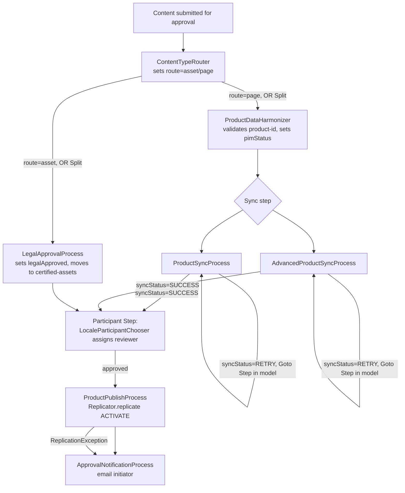

# Use Case: Product Publish/Approval Workflow

## 1. Real-life scenario

A new product page or DAM asset needs a multi-step human+automated approval
chain before it goes live: route it to the right process based on content
type, sync/validate its data against external systems (with retry on
failure), get it legally approved (assets) or reviewed by the right
locale-specific team (pages), auto-publish once approved, and notify the
requester of the outcome. This is the biggest cluster in the repo — a full
custom AEM Workflow implementation spanning `WorkflowProcess` steps and a
`ParticipantStepChooser`.

## 2. Where it lives

| Stage | File | SPI |
|---|---|---|
| Branch by content type | `workflows/ContentTypeRouter.java` | `WorkflowProcess` |
| Legal approval + DAM move (assets) | `workflows/LegalApprovalProcess.java` | `WorkflowProcess` |
| PIM validation (basic) | `workflows/ProductDataHarmonizer.java` | `WorkflowProcess` |
| External sync, simple version | `workflows/ProductSyncProcess.java` | `WorkflowProcess` |
| External sync, advanced version | `workflows/AdvancedProductSyncProcess.java` | `WorkflowProcess` |
| Dynamic reviewer assignment | `workflows/LocaleParticipantChooser.java` | `ParticipantStepChooser` |
| Auto-publish on approval | `workflows/ProductPublishProcess.java` | `WorkflowProcess` |
| Email the outcome | `workflows/ApprovalNotificationProcess.java` | `WorkflowProcess` |

## 3. Code flow, step by step

### 3a. Branching: `ContentTypeRouter`

The simplest step in the cluster, and a good one to start with because it
explains a pattern the rest of the cluster depends on: it doesn't move any
content or call any API — it just writes `route = "asset"` or `route =
"page"` into the workflow's `MetaDataMap` based on the payload path
prefix. The class comment is explicit that **the actual branching happens
in the Workflow Model itself** — an OR Split configured in the AEM
Workflow Console/editor with a rule like
`${workflowData.metaData.route == 'asset'}`. This Java step only sets the
variable the model's rule reads; it doesn't and can't control flow by
itself. Important distinction for an interview: workflow branching/looping
logic in AEM lives partly in Java (setting variables) and partly in the
workflow model's graph (routing on those variables) — neither half alone
implements the branch.

### 3b. Asset path: `LegalApprovalProcess`

1. Opens a service-user resolver, gets the asset's `jcr:content` resource,
   adapts it to a raw JCR `Node`, and sets `legalApproved = true` directly
   via the JCR API (not `ValueMap`/`ModifiableValueMap` — a deliberate
   choice covered in section 5).
2. Computes a destination path under `/content/dam/certified-assets/`
   using the asset's own name, then calls `session.move(payloadPath,
   destinationPath)` — moving assets after approval into a "certified"
   folder is a common real DAM governance pattern.
3. Calls `session.save()` directly on the JCR session (not
   `resolver.commit()`) — since `Node`/`Session` and `ResourceResolver`
   share the same underlying JCR session here, this persists both the
   property change and the move in one call.

### 3c. Page path: `ProductDataHarmonizer` → sync process

1. `ProductDataHarmonizer` reads a `product-id` from the payload's
   `jcr:content/metadata` node, throws `WorkflowException` if missing
   (a hard-stop, correctly — there's nothing useful to sync without an ID),
   and otherwise sets a `pimStatus` workflow variable to `"validated"` —
   explicitly stubbed (`// use an OSGI service with retry capability to
   validate PIM`), since the real PIM call isn't implemented here.
2. **`ProductSyncProcess`** (the simpler version) then fetches product
   data via an injected `ExternalApiService`, and on a blank/failed
   response calls `handleRetryLogic()`, which increments a `retryCount`
   workflow variable and sets `syncStatus = "RETRY"` up to 3 attempts,
   throwing `WorkflowException` on the final failure.
3. **`AdvancedProductSyncProcess`** (the more sophisticated version) does
   the same retry logic but calls the external API directly with
   `HttpClient` instead of going through a shared service, checks the HTTP
   status code explicitly, and uses **Resource API + `resolver.commit()`**
   rather than raw JCR — see section 5 for the full comparison.

### 3d. The retry loop — and where it actually lives

Both sync processes' `handleRetryLogic()` methods contain the same
comment block explaining something crucial about AEM workflow loops: a
Java `WorkflowProcess` **cannot loop by itself** — `execute()` runs once
per work item and returns. To actually retry a step, the Java code only
sets a `syncStatus = "RETRY"` variable; the looping mechanism itself is a
**"Goto Step"** configured in the Workflow Model, pointed back at this
same process step, with a routing rule checking that variable. This is
the same "Java sets variables, the model's graph does the actual control
flow" pattern seen in `ContentTypeRouter` — worth generalizing as a
principle: custom workflow Java steps are read/write on workflow
variables; branching and looping are properties of the model graph
around them.

### 3e. Reviewer assignment: `LocaleParticipantChooser`

A `ParticipantStepChooser` — a different SPI from `WorkflowProcess`,
used specifically for a **Participant Step** in the model (a human
approval step) rather than an automated process step. `getParticipant()`
returns a group/user ID string based on a locale check against the
payload path (`/fr/`, `/de/`, else a default `global-reviewers` group) —
the workflow model assigns the resulting task to whichever
group/user ID this returns.

### 3f. Publish + notify: `ProductPublishProcess` → `ApprovalNotificationProcess`

1. `ProductPublishProcess` gets the JCR `Session` directly off the
   `WorkflowSession` (no separate service-user resolver needed — the
   comment notes the workflow itself already runs as a configured
   workflow service user) and calls `Replicator.replicate(session,
   ACTIVATE, payloadPath)` — the synchronous 3-arg overload here, not the
   async `ReplicationOptions` variant used elsewhere in the codebase
   (`ProductActivationListener`) — appropriate in a workflow step, since
   blocking briefly inside a workflow step (which already runs on its own
   dedicated thread, not the resource-observation thread) is acceptable.
2. Writes `publishStatus`/`publishedPath` (success) or
   `publishStatus`/`publishError` (failure) into the workflow metadata for
   the next step to read, and correctly **both** records the failure
   *and* throws `WorkflowException` on error — the comment explains this
   dual behavior deliberately: downstream steps can still see what
   happened even though the workflow instance halts.
3. `ApprovalNotificationProcess` reads those variables, builds a
   success/failure email body, and sends it via AEM's `MessageGatewayService`
   — and deliberately does **not** rethrow on email failure (a failed
   notification shouldn't flip an already-successfully-published workflow
   into "failed" status).

## 4. Flow diagram

## 5. Approach comparison — `ProductSyncProcess` vs `AdvancedProductSyncProcess`

| | `ProductSyncProcess` | `AdvancedProductSyncProcess` |
|---|---|---|
| API call mechanism | Delegates to injected `ExternalApiService` (a shared OSGi service) | Builds its own `HttpClient` inline per execution, calls the API directly |
| Content persistence | Doesn't touch JCR content at all — only workflow metadata | Uses `resolver.hasChanges()`/`resolver.commit()` — Resource API, not raw JCR (see the gotcha below though) |
| HTTP status handling | Treats any blank response as failure | Explicitly checks status code, branches on `200` vs. anything else |
| Reusability | The shared `ExternalApiService` could be reused by other classes (and is a better fit if multiple workflow steps or services need the same external call) | Self-contained but not reusable — another class needing the same API call would have to duplicate the `HttpClient` logic |

**Interview framing:** `ProductSyncProcess` is the version to point to as
"the right general shape" — delegate the actual API call to a shared,
testable service rather than embedding `HttpClient` construction directly
in a workflow step. `AdvancedProductSyncProcess` is worth knowing as the
more thorough example of status-code-aware handling and Resource API use,
but its main lesson is arguably the gotcha in section 6: its own
class-level comment promises something the code doesn't actually deliver.

## 6. Gotchas / edge cases handled — and several real bugs

- `ProductPublishProcess` and `ApprovalNotificationProcess` both correctly
  distinguish which failures should halt the workflow (`WorkflowException`)
  versus which shouldn't (a caught, logged, swallowed email failure) —
  this pair is the cleanest example in the cluster of getting that
  distinction right.

## 7. Likely interview questions this maps to

### Workflow fundamentals

1. "How do you branch a workflow based on custom Java logic?" — a Java
   `WorkflowProcess` step sets a metadata variable; the actual branch is
   an OR Split in the Workflow Model with a rule reading that variable —
   walk through `ContentTypeRouter`
2. "How do you make a workflow step retry on failure?" — the step sets a
   status variable (e.g. `syncStatus=RETRY`) and increments a counter; a
   Goto Step in the model, configured separately from the Java code,
   routes back to the same step while the condition holds
3. "What's the difference between a `WorkflowProcess` and a
   `ParticipantStepChooser`?" — `WorkflowProcess` implements an automated
   process step; `ParticipantStepChooser` dynamically decides which
   user/group a *human* Participant Step gets assigned to
4. "How do steps pass data to each other?" — the shared `WorkflowData`
   `MetaDataMap`, written by one step and read by a later one — walk
   through `ProductPublishProcess` → `ApprovalNotificationProcess`
5. "When should a workflow step throw `WorkflowException` vs. just log and
   continue?" — throw when the business outcome genuinely failed and the
   workflow instance should show as failed (e.g. publish failure); swallow
   when the failure is non-critical to the already-completed business
   outcome (e.g. a notification email failing after a successful publish)

### JCR / Resource API choices

6. "Why does `ProductPublishProcess` not need a separate service-user
   resolver, while other steps in this cluster do?" — a workflow step
   already executes under the workflow engine's own configured service
   user; `workflowSession.getSession()` gives you that session directly
7. "Why would a step use raw JCR `Node`/`Session` instead of Resource
   API/`ValueMap`?" — `LegalApprovalProcess` needs `Session.move()`, which
   the Resource API doesn't provide directly — a legitimate reason to drop
   to the JCR layer for one specific operation while still using
   `ResourceResolver` for everything else
8. "What's the risk of moving a node to a path whose parent might not
   exist?" — `PathNotFoundException` from `Session.move()`; a step doing
   this should verify/create the destination parent first

### Code review / bug-spotting

9. "This class documents a helper method for resolving a user ID to an
   email address. Is it actually being used?" — trace the call graph in
   `ApprovalNotificationProcess`: no, `resolveUserEmail()` is dead code;
   the raw user ID is passed straight to the mail API
10. "This class's comment says it updates JCR metadata using the Resource
    API — does the code actually do that?" — no, in
    `AdvancedProductSyncProcess` only workflow variables are written;
    `resolver.commit()` has nothing to actually commit given the current
    implementation
11. "What would happen if the metadata node this step reads didn't exist?"
    — walk through the `ProductDataHarmonizer` NPE risk and how it's still
    caught (just not with a precise error message)
12. "Multiple steps in this workflow use different service-user subservice
    names. Is that a problem?" — not inherently, but it's an operational
    risk: each needs its own explicit `ServiceUserMapperImpl` mapping, and
    inconsistent naming makes misses more likely during setup

### Architecture / design

13. "Compare the two product-sync implementations — which would you keep
    in a real codebase?" — walk through section 5; lead with delegating
    the API call to a shared, testable service (`ProductSyncProcess`'s
    approach) over embedding `HttpClient` construction directly in a
    workflow step
14. "Why does `LocaleParticipantChooser` return a group ID string instead
    of, say, resolving and returning a specific user?" — the workflow
    model assigns the resulting task to that group, letting any member
    claim it — appropriate for a review step where any qualified
    translator/reviewer should be able to pick it up, versus routing to
    one specific named individual

### Debugging scenarios

15. "Approvers report they never received the outcome email for a
    workflow. What would you check first?" — exactly the
    `resolveUserEmail()` bug: confirm whether the raw initiator ID is
    being passed as the recipient address instead of a real resolved email
16. "A product sync workflow step keeps looping forever and never
    completes. What would you check?" — the Goto Step's routing condition
    in the Workflow Model itself (not just the Java `retryCount` logic) —
    a mismatched or always-true condition in the model would loop
    indefinitely regardless of what the Java code does
17. "An asset approval step fails with a generic exception when moving
    approved assets. What's a likely cause?" — the destination folder
    (`/content/dam/certified-assets/...`) not existing yet
