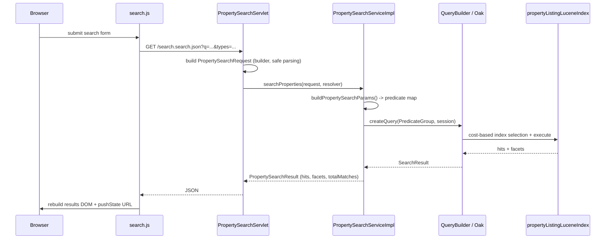

# Use Case: Property Listing & Property Search

## 1. Real-life scenario

A real-estate site needs two things: an **author-friendly property listing
page** (photos, rooms, price, agent, open-house dates) and a **fast search
experience** on top of hundreds/thousands of those listings — filter by
type/status/price/amenities, see facet counts, sort, paginate. This cluster
covers both: the authoring/rendering side (`propertylisting`) and the
query/search side (`propertysearch`).

## 2. Where it lives

| Concern | File |
|---|---|
| Listing model (interface) | `core/.../models/PropertyListing.java` |
| Listing model (impl) | `core/.../models/impl/PropertyListingImpl.java` |
| Listing dialog | `ui.apps/.../propertylisting/_cq_dialog/.content.xml` |
| Listing render script | `ui.apps/.../propertylisting/propertylisting.html` |
| Listing custom datasource | `core/.../datasources/PropertyTypeDataSourceServlet.java` |
| Search request/result DTOs | `core/.../services/search/PropertySearchRequest.java`, `PropertySearchResult.java` |
| Search service (interface) | `core/.../services/search/PropertySearchService.java` |
| Search service (impl) | `core/.../services/search/PropertySearchServiceImpl.java` |
| Search JSON endpoint | `core/.../servlets/PropertySearchServlet.java` |
| Search frontend | `ui.apps/.../propertysearch/clientlibs/propertysearch/js/search.js` |
| Oak indexes | `ui.apps/.../oak_index/propertyListingLuceneIndex`, `propertyListingPropertyIndex`, `agentProfileLuceneIndex` |

## 3. Code flow, step by step

### 3a. Listing page render (author → visitor)

1. Author fills the Touch UI dialog (`_cq_dialog/.content.xml`) — this is
   your Coral UI 3 field-type showcase (multifield, nested multifield,
   RTE, tagpicker, date-range pair, custom datasource dropdown, etc.)
2. Request hits `propertylisting.html`. `data-sly-use.model` adapts the
   current `Resource` to `PropertyListing` (Sling Model).
3. `PropertyListingImpl` fires `@PostConstruct init()`, which runs six
   derivation steps in sequence:
   - `adaptGallery()` — adapts each `gallery` child resource to `GalleryImage`
   - `adaptRooms()` — adapts each `rooms` child to `Room` (which internally
     adapts its own nested `features` children — two levels of `@ChildResource`)
   - `resolveAmenityNames()` — turns stored tag IDs into display names via
     `TagManager.resolve(id).getTitle(locale)`
   - `buildFormattedPrice()` — locale-aware currency formatting with a
     fallback if the currency code is invalid
   - `validateOpenHouseRange()` — parses both date strings and checks
     `end.isAfter(start)`
   - `resolveNeighborhoodGuide()` — resolves an optional Content Fragment
     by path, using **direct instantiation** (`new NeighborhoodGuide(resource)`)
     rather than `adaptTo()`, because that model takes a constructor argument
4. HTL renders the derived values. Notable HTL details: `fullDescription`
   uses `@context='html'` (raw RTE output), `themeColor` uses
   `@context='styleString'` (safe CSS injection), and the open-house RSVP
   button only renders `data-sly-test="${model.openHouseRangeValid}"` —
   the server-side validation directly gates what the visitor sees.

### 3b. Search request (visitor → results)

1. Visitor submits the search form on the `propertysearch` component.
2. `search.js` intercepts the submit, serializes form fields, and fires an
   AJAX `GET` to `<page>.search.json?<params>` — no full page reload.
3. `PropertySearchServlet` (bound to `resourceType=searchpage`,
   `selector=search`, `extension=json`) reads each request parameter and
   builds a `PropertySearchRequest` via its builder (comma-split for
   multi-value params like `types` and `tags`, safe numeric parsing with
   fallbacks).
4. `PropertySearchServiceImpl.searchProperties()` converts the request into
   a flat `Map<String,String>` of QueryBuilder predicates
   (`buildPropertySearchParams`) — path scope, resourceType filter,
   fulltext, OR-filters for type/status, a price range predicate,
   AND-filters for amenity tags, sort, pagination, `p.guessTotal`, and
   facet extraction — then calls `queryBuilder.createQuery(...).getResult()`.
5. Hits are mapped to `PropertyHit` DTOs, facets extracted from
   `SearchResult.getFacets()`, and the whole thing wrapped in a
   `PropertySearchResult` returned as JSON (via Gson).
6. `search.js`'s `updateResults()` rebuilds the results DOM from the JSON
   and pushes the query string to the URL (`history.pushState`) so the
   search is bookmarkable.

### 3c. Which Oak index answers each query

This is the part worth knowing cold for an interview — you never name an
index in code; Oak's cost-based query planner picks one:

| Method | Index used | Why |
|---|---|---|
| `searchProperties()` | `propertyListingLuceneIndex` | Only index covering `/content/sibi-aem-one` with fulltext + `propertyType`(indexed) + `price`(ordered) together |
| `findAgentPagePath()` | `propertyListingPropertyIndex` | Single equality lookup on `agentId`; a synchronous property (B-tree) index beats Lucene for exact-match, and must be synchronous so a newly-added agent is findable immediately |
| `searchAgents()` | `agentProfileLuceneIndex` | Scoped to `/content/sibi-aem-one/en/agents`; `propertyListingLuceneIndex` explicitly excludes that path, so this is the only index that can serve it |

## 4. Flow diagram

## 5. Why it's built this way

- **Custom Oak indexes instead of the OOTB `cqPageLucene`** — the default
  page index isn't selective for domain-specific fields like `propertyType`
  or `price`, and doesn't have `ordered=true`/`facets=true` configured for
  them. Building narrow, purpose-scoped indexes (`includedPaths` restricted
  to `/content/sibi-aem-one`) keeps query cost low. *(Explicitly documented
  in your index `.content.xml` comments — not my inference.)*
- **A separate `agentProfileLuceneIndex` rather than reusing the property
  index** — property queries are excluded from that path, so agent search
  needed its own index scoped to the agents subtree, with `agentName`
  boosted (3.0) over bio text. *(Documented in code comments.)*
- **Builder pattern for `PropertySearchRequest`** — my inference: search
  requests have ~10 optional parameters (price range, tags, sort, paging).
  A builder with sane defaults (`pageSize=12`, `sortOrder=asc`) avoids a
  telescoping constructor and keeps the servlet's parameter-parsing code
  readable.
- **DTOs (`PropertySearchResult`, `PropertyHit`, `AgentHit`) instead of
  returning JCR `Hit`/`SearchResult` directly** — my inference: this
  decouples the JSON contract from JCR/QueryBuilder internals, and avoids
  leaking a `ResourceResolver`-bound object into a servlet response that
  gets serialized after the request may have moved on.
- **Direct instantiation for `NeighborhoodGuide` instead of `adaptTo()`** —
  explicitly documented in the code: Sling's `adaptTo()` only works for
  models with a no-arg constructor or field-only injection; a model that
  takes a `Resource` constructor argument has to be `new`'d directly.
- **Two-field date range instead of a single range widget** — explicitly
  documented: AEM/Coral UI 3 has no native date-range picker, so the
  project uses the standard real-world pattern of two `datepicker` fields
  validated server-side in the Sling Model.
- **`p.guessTotal` set explicitly** — explicitly documented: without it,
  QueryBuilder walks every matching node to compute an exact count, which
  is expensive at scale; an estimate bound avoids that cost.

## 6. Gotchas / edge cases handled

- `findAgentPagePath()` returns `null` early on a blank `agentId` rather
  than running a query with an empty predicate.
- `buildFormattedPrice()` catches currency-format exceptions and falls back
  to a manual `"%.2f CODE"` format rather than letting a bad currency code
  throw.
- `validateOpenHouseRange()` catches `DateTimeParseException` and treats an
  unparsable date pair as "invalid range" rather than propagating the
  exception up into page rendering.
- `mapPropertyHits()` and `searchAgents()` both skip a hit if its
  `jcr:content` child is missing, and catch `RepositoryException` per-hit
  so one bad node doesn't fail the whole result set.
- `PropertySearchServlet`'s numeric parsing (`parseDouble`,
  `parseIntOrDefault`) swallows `NumberFormatException` and falls back to
  `null`/defaults instead of erroring on malformed query params.
- The comment block after `searchProperties()` explicitly documents
  `ResourceResolver` lifecycle: the method never opens its own resolver,
  and the caller is responsible for closing theirs — a common AEM resource
  leak avoided by convention + comment rather than by a `try-with-resources`
  inside the service (since the resolver is a shared, caller-owned resource).

## 7. Likely interview questions this maps to

### Overall flow / architecture

1. "Walk me through how a search request flows from the browser to the JCR
   and back." — *section 3b/3c*
2. "Why is this a JSON servlet + client-side AJAX instead of a server-rendered
   results page?" — bookmarkable via `pushState` without full reload; keeps the
   listing page itself simple and cacheable, search results aren't
   dispatcher-cached the same way
3. "If this needed to scale to 10x the traffic, what's the first thing you'd
   look at?" — dispatcher/CDN caching of the `.search.json` responses (or lack
   thereof, since query params vary per request), `p.guessTotal` tuning,
   whether facets need to be pre-aggregated instead of computed per-request
4. "What would you change if this had to support 5 languages?" — path
   structure under `/content/sibi-aem-one/<locale>`, index `includedPaths`
   scoping, and where `Locale.ENGLISH` is currently hardcoded in
   `resolveAmenityNames()` — a real bug to be aware of, not just a talking point

### Oak / QueryBuilder internals

5. "How does Oak decide which index to use for a query, and how would you
   verify your assumption?" — cost-based planner; `p.explain=true`
6. "Why would you build a custom Oak index instead of relying on the OOTB
   one?" — selectivity, `includedPaths`, `ordered`/`facets` flags
7. "When would you use a synchronous vs asynchronous Oak index?" —
   `propertyListingPropertyIndex` sync for immediate agentId lookups vs the
   ~5s async lag on the Lucene indexes
8. "What happens if two indexes could both serve the same query?" — Oak
   scores both by estimated cost and picks the cheaper one; you can force/
   verify via `explain` or `p.limit`/index tag hints if truly ambiguous
9. "Why does `ordered=true` matter for the price field specifically?" —
   without it, sort falls back to reading every matching node from JCR
   (O(n) reads); with it, Lucene DocValues make it effectively O(1) per hit
10. "What's the difference between `evaluatePathRestrictions` being true vs
    false, practically?" — false means the index ignores the `path`
    predicate and returns repo-wide matches for Oak to post-filter, which is
    slower and can return misleading `p.guessTotal` estimates
11. "Your `amenityTags` filter uses multiple `N_property` predicates instead
    of one `tagid` predicate with multiple values — why, and what's the
    trade-off?" — good one to think through live: as written each tag is a
    separate AND'd predicate (must have ALL tags); if you wanted "has ANY of
    these tags" you'd need `.and=false`, similar to the propertyType pattern
12. "How would you debug a search query that's returning zero facets even
    though `facets=true` is set on the field?" — check `getFacets()` isn't
    null, confirm `facetextract.N_property.count` was actually included in
    the request params, and re-verify the index actually has `facets=true`
    committed (not just intended)

### Sling Models

13. "How does a nested multifield map to Sling Models?" — two levels of
    `@ChildResource`, `Room` adapting its own `features` children
14. "Why does `resolveNeighborhoodGuide()` use `new NeighborhoodGuide(resource)`
    instead of `resource.adaptTo(NeighborhoodGuide.class)`?" — constructor-arg
    models can't use Sling's `adaptTo()` machinery
15. "What's the difference between `DefaultInjectionStrategy.OPTIONAL` and
    `REQUIRED`, and why does this model use `OPTIONAL`?" — required would
    make the whole model fail to instantiate if any single `@ValueMapValue`
    is missing, which is wrong for a component with many optional fields
    (subtitle, soldDate, neighborhood guide, etc.)
16. "Where's the actual business logic in this model, and why is it in
    `@PostConstruct` instead of the getters?" — computing once at
    construction (`init()`) instead of recomputing on every getter call;
    trade-off is you pay the cost even for fields the template never reads

### API / servlet design

17. "Why is this a `SlingSafeMethodsServlet` and not a regular `SlingServlet`
    or `HttpServlet`?" — GET-only, semantically safe/idempotent, and it's the
    Sling-idiomatic way to register a resource-type + selector + extension
    bound endpoint
18. "How would you add input validation here — e.g. reject a `priceMin`
    greater than `priceMax`?" — currently absent; good one to actually
    sketch out live, since it's a real gap you could point to and fix
19. "What HTTP status would a malformed request return today, and is that
    correct?" — currently falls back silently to defaults/nulls rather than
    a 400; worth having an opinion on whether that's the right UX for a
    search endpoint vs a stricter API

### Debugging scenarios (framed as "what would you check first")

20. "A property listing page is showing 'Price on request' for a property
    that definitely has a price authored. What do you check?" — trace
    `buildFormattedPrice()`: null price value, or a currency code that
    doesn't resolve via `Currency.getInstance()`, which falls into the
    catch block
21. "Search results are stale — a newly published property doesn't show up
    for ~5 seconds. Is that a bug?" — no, that's expected async-index lag on
    the Lucene index; know the difference between what's "your bug" vs
    "documented system behavior" here
22. "Facet counts don't match the number of hits shown. Why might that
    happen, and is it actually wrong?" — `p.guessTotal` gives an *estimate*,
    not an exact count, by design — this is a common point of confusion to
    be able to explain confidently rather than treat as a bug
