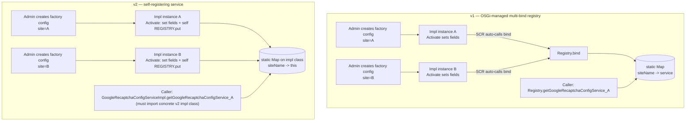

# Use Case: Multi-Site reCAPTCHA Config via OSGi Factory Configs + Service Versioning

## 1. Real-life scenario

A multi-site AEM instance (several brand sites sharing one author/publish
tier) needs a *different* Google reCAPTCHA site key per site, configured
independently by admins per site — not one global key. This cluster shows
the standard AEM pattern for "one interface, many config instances, looked
up by name" using OSGi **factory configurations**, plus two different
implementations (`v1`/`v2`) of how to build a lookup registry on top of
that pattern — a common thing to be asked to compare or refactor in an
interview.

## 2. Where it lives

| Concern | File |
|---|---|
| Service contract | `core/.../services/GoogleRecaptchaConfigService.java` |
| Config schema (shared by both versions) | `core/.../configs/GoogleRecaptchaConfig.java` |
| v1 implementation | `core/.../services/impl/v1/GoogleRecaptchaConfigServiceImpl.java` |
| v2 implementation | `core/.../services/impl/v2/GoogleRecaptchaConfigServiceImpl.java` |

## 3. Code flow, step by step

### 3a. The shared foundation

1. `GoogleRecaptchaConfigService` is a plain interface: `getSiteName()`,
   `getPublicKey()`, `getPrivateKey()`.
2. `GoogleRecaptchaConfig` is an `@ObjectClassDefinition` — the config
   *schema* (siteName/publicKey/privateKey, all required strings).
3. Both impls use `@Designate(ocd = GoogleRecaptchaConfig.class, factory =
   true)` — the `factory = true` is the key detail: it lets an admin
   create **multiple independent instances** of this OSGi config under
   `/system/console/configMgr` (one per site), each producing its own
   component instance, rather than a single config for the whole component.

### 3b. v1 — dedicated registry component using OSGi multi-bind

1. Each `GoogleRecaptchaConfigServiceImpl` (v1) instance just holds its own
   `siteName`/`publicKey`/`privateKey`, set in `@Activate @Modified` — no
   registry logic in the main class at all.
2. A **separate static inner OSGi component**, `Registry`, is registered
   independently (`@Component(service = Registry.class)`).
3. `Registry` declares `@Reference(cardinality = MULTIPLE, policy =
   DYNAMIC)` on `GoogleRecaptchaConfigService` — this tells OSGi's
   Service Component Runtime (SCR) to automatically call `bind()` for
   **every** currently-registered instance of the service (i.e. every
   factory config instance), and `unbind()` whenever one goes away.
4. `bind()`/`unbind()` maintain a shared `ConcurrentHashMap<String,
   GoogleRecaptchaConfigService>` keyed by site name.
5. Callers look up a config by site via the static
   `Registry.getGoogleRecaptchaConfigService(siteName)`.

### 3c. v2 — self-registering service, no separate registry component

1. Each `GoogleRecaptchaConfigServiceImpl` (v2) instance holds a
   **`static`** `ConcurrentHashMap` directly on the impl class itself —
   shared across all factory-config instances of this class (since static
   fields belong to the class, not the instance).
2. `@Activate @Modified` sets the instance fields **and** does
   `REGISTRY.put(siteName, this)` — the component registers *itself* into
   its own static map.
3. `@Deactivate` does `REGISTRY.remove(siteName)`.
4. Callers look up a config via the static
   `GoogleRecaptchaConfigServiceImpl.getGoogleRecaptchaConfigService(siteName)`
   — note this is a **concrete impl class in a versioned package**, not the
   interface.

## 4. Flow diagram

## 5. Approach comparison

| | v1 (dedicated `Registry` component) | v2 (self-registering impl) |
|---|---|---|
| Who owns the registry map | A separate component (`Registry`), decoupled from the service impl | The service impl class itself (`static` field) |
| How instances get tracked | Declaratively — OSGi SCR calls `bind()`/`unbind()` automatically via `@Reference(cardinality=MULTIPLE, policy=DYNAMIC)` | Imperatively — the component calls `REGISTRY.put()`/`remove()` itself in its own lifecycle methods |
| Caller depends on | The `Registry` type — still one hop from the plain `GoogleRecaptchaConfigService` interface, but not a specific impl package | The **concrete v2 impl class** directly — breaks interface-based decoupling |
| Separation of concerns | Clean — config-holding logic and registry logic are two different components | Mixed — the same class is both "a config instance" and "the keeper of all config instances" |
| Idiomatic OSGi? | Yes — this is the standard pattern for "track all live instances of a multi-instance service" | Works, but reinvents what SCR's dynamic multi-reference already does for you |

**Interview framing:** if asked "how would you look up the right config
among several factory-configured instances of the same service," v1's
pattern is the one to lead with — it's the idiomatic OSGi answer (let SCR
manage instance tracking via a dynamic multi-cardinality reference) and it
keeps callers depending only on interfaces, never a specific impl class.
v2 is worth knowing to recognize and explain what's wrong with it, since
"a service that manually manages a static registry of itself" is a
real-world smell you'll encounter in legacy code.

## 6. Gotchas / edge cases handled — and one not handled, in both versions

- Both impls correctly key the registry by `siteName`, allowing an
  arbitrary number of site-specific configs to coexist.
- **Neither version handles a config's `siteName` being changed via a
  live `@Modified` cleanly** — this is a real, traceable bug in both,
  worth being able to explain if you were asked to review this code:
  - **v1**: `Registry.bind()` is called once when the service reference is
    first satisfied, using `getSiteName()` at that moment as the map key.
    If an admin later edits the factory config and changes `siteName`,
    `@Modified` updates the impl's field, but SCR does **not** re-call
    `bind()` just because the target service's own properties changed
    (only if the reference itself is added/removed) — so the `Registry`'s
    map key becomes stale, pointing to an instance whose `getSiteName()`
    now disagrees with the key it's stored under.
  - **v2**: `@Activate @Modified` on the same method means editing the
    config *does* re-run `REGISTRY.put(newSiteName, this)` — so the new
    key correctly resolves. But the **old key is never removed**, so the
    map accumulates a stale entry under the old site name pointing at the
    same (now-renamed) instance — a small leak and a source of confusing
    "wrong config returned for this site name" bugs.
- Neither version is wired into any actual servlet/form in this repo —
  confirmed by searching the codebase — so treat both as demonstrations of
  the registration pattern, not a complete working reCAPTCHA integration.

## 7. Likely interview questions this maps to

### OSGi factory configs

1. "How do you let an admin create multiple independent configurations of
   the same component in AEM?" — `@Designate(factory = true)` on an
   `@ObjectClassDefinition`-annotated config interface
2. "What's the practical difference between a factory config and a regular
   singleton OSGi config?" — factory configs produce one component
   instance per config entry (each gets its own PID suffix); a singleton
   config backs exactly one component instance
3. "Where would an admin manage these in AEM?"
   — `/system/console/configMgr`, each factory instance listed separately

### Dynamic multi-reference tracking

4. "How do you track *all* live instances of a multi-instance service in
   another component?" — `@Reference(cardinality =
   ReferenceCardinality.MULTIPLE, policy = ReferencePolicy.DYNAMIC)` with
   `bind()`/`unbind()` methods; SCR calls them automatically as instances
   come and go
5. "What does `ReferencePolicy.DYNAMIC` actually buy you over `STATIC`?"
   — dynamic allows bind/unbind to happen at runtime without deactivating
   the referencing component; static would require the whole component to
   restart when the set of bound services changes
6. "Walk me through what happens when an admin deletes one of the factory
   config instances." — the corresponding service instance is
   deactivated/unregistered; SCR calls `unbind()` on `Registry` (v1) or
   `@Deactivate` fires `REGISTRY.remove()` (v2) — either way, the entry
   should disappear from the lookup map

### Architecture / code review

7. "Compare these two implementations — which would you keep, and why?" —
   walk through section 5's comparison table; lead with v1's cleaner
   separation of concerns and its avoidance of exposing a concrete impl
   class to callers
8. "What's wrong with a service class holding a `static` registry of all
   its own instances?" — couples two responsibilities (being a config
   holder vs. being a directory of all config holders) into one class, and
   forces callers to depend on a specific implementation package instead
   of the interface — breaks the whole point of programming to an interface
9. "If a caller needs to look up a site's reCAPTCHA config, what should it
   depend on?" — the interface or a dedicated registry/service, never a
   versioned impl class like `com.sibi.aem.one.core.services.impl.v2.GoogleRecaptchaConfigServiceImpl`

### Debugging scenarios

10. "An admin renamed a site's reCAPTCHA config's `siteName` in the
    factory config, and now lookups by the new name return nothing (v1) —
    what's going on?" — trace through the stale-bind explanation in
    section 6; SCR didn't re-trigger `bind()` on a property-only change
11. "In v2, after the same rename, you find *two* entries in the registry
    map for what should be one site — why?" — `@Modified` re-runs
    `activate()`, which re-inserts under the new key but never removes the
    old one
12. "How would you fix either version to handle a live `siteName` change
    correctly?" — good one to actually reason through live: e.g. track the
    previously-registered key on the instance itself and remove it in
    `@Modified` before inserting the new one, or force a full
    deactivate/reactivate cycle on property changes that affect the
    registry key
